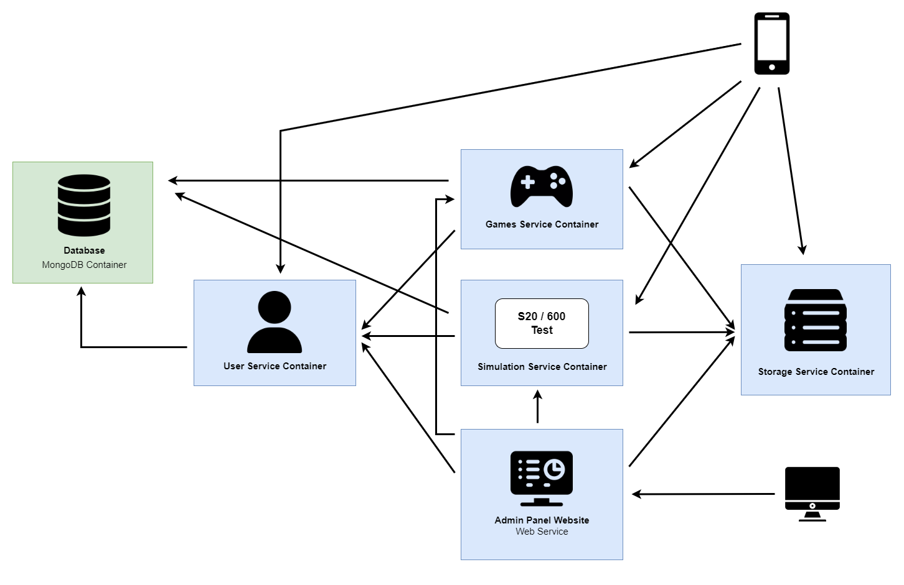

  <h2 style="text-align: center;font-weight: bold">Project Charter Container Based App 
Mobile Apps e-TOEFL</h2>
  <h5 style="text-align: center;">Dosen Pengampu : Dr. Ferry Astika Saputra, S.T., M.Sc.</h5>

 

  
  <h4 style="text-align: center;">Disusun Oleh :  Kelompok 3 dan 5</h4>
  

    <table>
      <tr>
        <th>No</th>
        <th>Nama</th>
        <th>NRP</th>
      </tr>
      <tr>
        <td>1</td>
        <td>Gede Hari Yoga Nanda</td>
        <td>3122500005</td>
      </tr>
      <tr>
        <td>2</td>
        <td>Arsyita Devanaya Arianto</td>
        <td>3122500008</td>
      </tr>
      <tr>
        <td>3</td>
        <td>Ali Azhar</td>
        <td>3122500011</td>
      </tr>
      <tr>
        <td>4</td>
        <td>Mahendra Khibrah R. S</td>
        <td>3122500013</td>
      </tr>
      <tr>
        <td>5</td>
        <td>Mayada Azizah</td>
        <td>3122500015</td>
      </tr>
      <tr>
        <td>6</td>
        <td>Gandi Rukmaning Ayu</td>
        <td>3122500016</td>
      </tr>
      <tr>
        <td>7</td>
        <td>Adam Rasyid Nurmuhammad</td>
        <td>3122500018</td>
      </tr>
      <tr>
        <td>8</td>
        <td>Adinda Zahra Q</td>
        <td>3122500020</td>
      </tr>
      <tr>
        <td>9</td>
        <td>M Reza Muktasib</td>
        <td>3122500024</td>
      </tr>
      <tr>
        <td>10</td>
        <td>Shofira Izza N</td>
        <td>3122500026</td>
      </tr>
    </table>
  

<h4 style="text-align: center;line-height: 1.5">Politeknik Elektronika Negeri Surabaya Departemen Teknik Informatika Dan Komputer Program Studi Teknik Informatika 2023/2024</h4>
  

## Daftar Isi

- [Daftar Isi](#daftar-isi)
- [Pendahuluan](#pendahuluan)
- [Ruang Lingkup](#ruang-lingkup)
- [Desain Sistem](#desain-sistem)
- [Tim dan Tugas](#tim-dan-tugas)
- [Tahapan Pelaksaan](#tahapan-pelaksaan)
- [Implementasi](#implementasi)
- [Sistem testing](#sistem-testing)
- [Kesimpulan](#kesimpulan)

## Pendahuluan

Docker adalah platform perangkat lunak yang memudahkan pembuatan, pengujian, dan penerapan aplikasi dengan cepat. Docker mengemas perangkat lunak ke dalam kontainer yang berisi semua kebutuhan perangkat lunak agar bisa berfungsi, seperti pustaka, alat sistem, kode, dan runtime. Dengan Docker, kita dapat dengan mudah menerapkan dan menskalakan aplikasi di berbagai lingkungan. Docker memiliki beberapa manfaat yaitu, portabilitas aplikasi yang dapat dijalankan di lingkungan apapun tanpa perlu mengubah konfigurasi, isolasi yang memastikan setiap kontainer berjalan terpisah dan aman dari aplikasi lain, kemudahan deployment dan skalabilitas aplikasi untuk menambah atau mengurangi instance kontainer dengan mudah.

Pada aplikasi eTOEFL, kami menggunakan Storage Server untuk menyimpan dan mengambil data, seperti file atau dokumen besar. Kami juga memanfaatkan Web Server yang menggunakan framework Laravel untuk mengelola request pengguna serta berinteraksi dengan Storage Server dan MongoDB Database untuk operasi CRUD. Selanjutnya, MongoDB Database digunakan untuk menyimpan data aplikasi. Terakhir, Docker Engine dipakai untuk mengembangkan, mmengirimkan dan menjalankan aplikasi dalam kontainer. Kemudian, Docker akan menghubungkan antarmuka pengguna pada perangkat mobile dengan backend seperti Web Server, MongoDB, dan Storage Server.

## Ruang Lingkup

eTOEFL adalah aplikasi berbasis mobile yang dikembangkan dengan Flutter dan memungkinkan pengguna untuk mengakses berbagai fitur dengan mudah. Kemudian, backend aplikasi menggunakan framework Laravel untuk mengatur autentikasi pengguna dan berinteraksi dengan database untuk penyimpanan dan pengambilan data. Untuk database aplikasi menggunakan MongoDB NoSQL yang berfungsi menyimpan dan mengambil data dari database serta memberikan respons terhadap permintaan pengguna. Terakhir, Server berfungsi sebagai perantara antara aplikasi mobile, backend, dan database. Server juga menerima request dari pengguna, kemudian meneruskannya ke backend dan database yang nantinya akan mengirimkan kembali respons kepada pengguna

## Desain Sistem

  

1. **Storage Server** berjalan pada port 3000 yang bertanggung jawab untuk menyimpan dan mengambil data, khususnya file atau dokumen besar yang diperlukan oleh aplikasi.

2. **Web Server Laravel** berjalan pada port 80, dikembangkan dengan framework laravel dengan peran sebagai pusat logika bisnis aplikasi dan mengelola permintaan dari frontend. Web server laravel bekerja untuk menerima permintaan dari docker engine, berkomunikasi dengan storage server untuk manajemen file, dan menjalankan operasi CRUD ke MongoDB database.

3. **MongoDB Database** berjalan pada port 27017 dan menerima permintaan dari web server larave melalui Docker Engine. MongoDB database bertugas untuk menyimpan data aplikasi dalam format NoSQL dan menjalankan operasi CRUD yang diminta oleh web server Laravel.

4. **Docker Engine** berperan sebagai perantara antara Mobile FE dan layanan backend seperti web server laravel, storage server, dan MongoDB database. Docker Engine berkomunikasi dengan Mobile FE melalui layanan backend yang sesuai, menerima permintaan, dan mengirimkan response.

5. **Mobile FE** berfungsi untuk menyajikan antarmuka pengguna yang dapat diakses melalui perangkat mobile. Mobile FE berinteraksi dengan Docker Engine untuk mengakses layanan backend dan menerima response.

## Tim dan Tugas

- **UI/UX**

1. Ali Azhar (3122500011)
2. Mayada Azizah (3122500015)
3. Gandi Rukmaning Ayu (3122500016)
4. Adinda Zahra Q (3122500020)

- **FrontEnd Mobile**

1. Arsyita Devanaya Arianto (312250000)
2. Ali Azhar (3122500011)
3. Mahendra Khibrah R. S (3122500013)
4. Mayada Azizah (3122500015)
5. Gandi Rukmaning Ayu (3122500016)
6. Adam Rasyid Nurmuhammd (3122500018)
7. Adinda Zahra Q (3122500020)
8. M Reza Muktasib (3122500024)
9. Shofira Izza N (3122500026)

- **BackEnd Mobile**

1. Gede Hari Yoga Nanda (3122500005)
2. Mahendra Khibrah R. S (3122500013)
3. M Reza Muktasib (3122500024)

- **Consume API**

1. Arsyita Devanaya Arianto (312250000)
2. Mahendra Khibrah R. S (3122500013)
3. Mayada Azizah (3122500015)
4. Adam Rasyid Nurmuhammd (3122500018)
5. Adinda Zahra Q (3122500020)
6. M Reza Muktasib (3122500024)
7. Shofira Izza N (3122500026)

- **Database**

1. Gede Hari Yoga Nanda (3122500005)

## Tahapan Pelaksaan

1. **Perancanaan dan Analisis**
   - **Menentukan Tujuan dan Sasaran:**
     - **Meningkatkan persiapan tes e-TOEFL bagi mahasiswa PENS:** Aplikasi e-TOEFL dirancang untuk membantu mahasiswa PENS mencapai nilai tes e-TOEFL yang optimal. Hal ini penting karena tes e-TOEFL merupakan salah satu prasyarat kelulusan di PENS.
     - **Memberikan pengalaman belajar yang dipersonalisasi:** Pengguna dapat memilih topik latihan yang sesuai dengan minat dan kebutuhan mereka. Hal ini dapat membantu mereka fokus pada area yang perlu diperbaiki. Selain itu, pengguna dapat melihat skor simulasi tes dan latihan mereka. Hal ini dapat membantu mereka melihat bagaimana mereka berkembang dan tetap termotivasi.
     - **Membuat tes e-TOEFL lebih mudah diakses:** Aplikasi ini tersedia di perangkat seluler, sehingga pengguna dapat belajar dan berlatih kapanpun dan dimanapun mereka mau.
   - **Mengidentifikasi Target Pengguna:** Memahami kebutuhan, preferensi, dan poin-poin yang membuat frustasi pengguna target.
   - **Melakukan Riset Pasar:** Menganalisis aplikasi persiapan TOEFL yang ada, mengidentifikasi kekuatan dan kelemahannya, dan menemukan celah pasar yang potensial. Ini akan membantu membedakan aplikasi e-TOEFL dengan aplikasi lain dan memenuhi kebutuhan pengguna yang belum terpenuhi.
   - **Membuat Rencana Proyek:** Membuat garis besar proses pengembangan, termasuk garis waktu, pencapaian, dan pembagian tugas.
   - **Pemilihan Tumpukan Teknologi:** Memilih teknologi yang sesuai untuk pengembangan front-end (aplikasi seluler) dan back-end (sisi server), berbagai faktor perlu dipertimbangkan, seperti bahasa pemrograman, framework, database, dan alat containerization.
2. **Desain dan Prototype**
   - **Desain Antarmuka Pengguna (UI):** Membuat wireframe dan mockup untuk memvisualisasikan tata letak, navigasi, dan elemen visual aplikasi.
   - **Desain Pengalaman Pengguna (UX):** Merancang aliran pengguna, memastikan navigasi yang mudah, interaksi yang jelas, dan pengalaman keseluruhan yang tepat.
   - **Pengembangan Konten:** Mencari pertanyaan latihan TOEFL berkualitas tinggi, terpercaya, dan selaras dengan format dan standar TOEFL terbaru.
3. **Pengembangan dan Implementasi**
   - **Pengembangan Front-end:**
     - **Flutter:** Bahasa pemrograman Flutter dipilih untuk membangun aplikasi mobile yang handal dan berkinerja tinggi.
   - **Pengembangan Back-end:**
     - **MongoDB:** MongoDB dipilih sebagai database untuk menyimpan data pengguna dan aplikasi dengan aman dan efisien. Struktur data NoSQL MongoDB yang fleksibel dan skalabel ideal untuk menangani data pengguna yang terus bertambah dan kebutuhan aplikasi yang berkembang.
     - **Laravel:** Web server Laravel digunakan untuk menangani permintaan API dan menyediakan fungsionalitas back-end. Laravel menawarkan framework PHP yang kokoh dan aman untuk membangun API yang handal dan mudah diintegrasikan dengan aplikasi mobile.
     - **Storage Server:** Storage server yang sesuai digunakan untuk menyimpan file dan data lainnya.
   - **Containerization : **
     - **Docker Engine:** Docker Engine diimplementasikan untuk memastikan aplikasi dapat dijalankan dengan mudah dan konsisten di berbagai lingkungan. Docker memungkinkan kontainerisasi layanan back-end, seperti web server Laravel, storage server, dan database MongoDB, sehingga aplikasi dapat dijalankan secara independen dan terisolasi.
     - **Komunikasi Antar Layanan:** Docker Engine bertindak sebagai perantara yang mengelola komunikasi antara aplikasi mobile dan berbagai layanan back-end. Docker Engine menerima permintaan dari aplikasi mobile dan meneruskannya ke layanan back-end yang sesuai, seperti web server Laravel, storage server, atau database MongoDB. Hal ini memastikan komunikasi yang efisien dan aman antar komponen aplikasi.
4. **Deployment dan Pemeliharaan**
   - **Deployment Aplikasi Mobile:** Membangun dan menguji aplikasi mobile Flutter, mempublikasikannya ke platform distribusi, dan memantau performa serta umpan balik pengguna
   - **Deployment Storage Server:** Mengkonfigurasi dan mengelola storage server untuk menyimpan data pengguna dan aplikasi dengan aman, memastikan skalabilitas dan ketersediaan, serta melakukan backup dan pemulihan data secara berkala.
   - **Deployment Web Server Laravel:** Web server Laravel merupakan komponen back-end dari aplikasi e-TOEFL. Proses deployment-nya meliputi beberapa langkah penting. Pertama, membangun image Docker yang berisi aplikasi Laravel dan semua dependensinya. Selanjutnya, menyiapkan file konfigurasi Docker Compose untuk mengkonfigurasi layanan, termasuk database dan web server. Setelah itu, menjalankan container Docker menggunakan Docker Compose untuk memulai layanan Laravel. Kemudian, memverifikasi aksesibilitas web server melalui browser atau alat lain untuk memastikan semuanya berjalan dengan benar. Terakhir, memastikan integrasi dengan storage server dan database untuk menyimpan dan mengambil data yang diperlukan. Langkah-langkah ini penting untuk memastikan web server e-TOEFL berfungsi dengan baik, terhubung dengan database dan storage server, serta mampu memberikan layanan pembelajaran yang handal.
   - **Deployment Docker Engine Container:** Proses deployment container Docker Engine untuk layanan back-end meliputi beberapa langkah penting. Pertama, membangun dan menguji image Docker yang berisi aplikasi back-end dan semua dependensinya. Setelah itu, menyebarkan image Docker ke Docker Engine dengan mengunggah image ke registry Docker, kemudian menarik dan menjalankan image tersebut pada Docker Engine di storage server. Terakhir, mengelola dan memperbaiki image Docker dan kontainer dengan memonitor container yang berjalan, melakukan update image Docker sesuai kebutuhan, da

## Implementasi

Menjalankan aplikasi e-TOEFL sesuai rencana yang telah disusun, memastikan setiap komponen sistem berfungsi dengan baik, dan melakukan penyempurnaan berdasarkan hasil pengujian dan umpan balik pengguna.

## Sistem testing

1. **Pengujian unit**
   - Setiap komponen aplikasi, baik front-end maupun back-end, diuji secara individual untuk memastikan setiap unit fungsionalitas berfungsi dengan benar.
   - Pengujian ini mencakup pengujian kode dalam container Docker untuk memastikan bahwa semua dependensi dan konfigurasi telah diatur dengan benar.
2. **Pengujian integrasi**
   - Memastikan bahwa berbagai layanan back-end berinteraksi dengan benar satu sama lain dan dengan front-end.
3. **Pengujian sistem**
   - Menguji keseluruhan aplikasi sebagai satu kesatuan untuk memastikan semua bagian bekerja bersama dengan baik.
4. **Uji pengguna**
   - Uji coba pengguna dilakukan untuk mendapatkan umpan balik dari pengguna nyata dan memastikan aplikasi memenuhi kebutuhan mereka.
   - Docker digunakan untuk membuat lingkungan pengujian yang konsisten untuk semua peserta uji coba, memastikan bahwa setiap pengguna mengalami aplikasi dalam kondisi yang sama.
   - Umpan balik dari uji pengguna digunakan untuk melakukan penyesuaian dan perbaikan, yang kemudian diuji ulang dalam container Docker untuk memastikan kualitas dan kinerja.

## Kesimpulan

Melalui tahapan pelaksanaan ini, diharapkan aplikasi e-TOEFL dapat membantu mahasiswa PENS dalam mempersiapkan diri menghadapi tes e-TOEFL dengan lebih baik, memberikan pengalaman belajar yang dipersonalisasi, serta membuat tes e-TOEFL lebih mudah diakses. Implementasi teknologi yang tepat serta pengujian yang komprehensif akan memastikan aplikasi berjalan dengan baik dan memenuhi kebutuhan pengguna.

Penerapan teknologi Docker Engine dalam aplikasi E-TOEFL menghadirkan banyak keuntungan. Konsistensi dan efisiensi operasional terjamin, deployment dan skalabilitas menjadi mudah, serta keamanan dan keandalan aplikasi terjaga. Docker Engine mengisolasi aplikasi, membuatnya aman dan terlindungi. Image yang tidak dapat diubah memastikan aplikasi selalu berjalan dalam kondisi yang ideal. Keunggulan ini menjadikan Docker Engine sebagai alat penting dalam memastikan kelancaran dan keandalan E-TOEFL.

Keunggulan utama dari penggunaan Docker dalam proyek ini meliputi:

- **Portabilitas:** Aplikasi dapat berjalan di berbagai lingkungan tanpa perlu mengubah konfigurasi, sehingga memudahkan proses pengembangan dan deployment.
- **Isolasi Lingkungan:** Setiap container berjalan terpisah, yang memastikan tidak ada konflik antara layanan yang berbeda dan meningkatkan keamanan
- **Skalabilitas:** Dengan Docker, menambah atau mengurangi instance container dapat dilakukan dengan mudah sesuai kebutuhan, memungkinkan aplikasi untuk mengelola beban kerja yang dinamis
- **Efisiensi:** Docker memungkinkan pemanfaatan sumber daya yang lebih baik dan meminimalkan overhead yang biasanya terkait dengan virtualisasi tradisional.
