

  <h2 style="text-align: center;font-weight: bold">Praktikum 4 Instalasi DNS</h2>
  <h4 style="text-align: center;">Dosen Pengampu : Dr. Ferry Astika Saputra, S.T., M.Sc.</h4>

 

  
  <h4 style="text-align: center;">Disusun Oleh :</h4>
  

    <strong>Gandi Rukmaning Ayu (3122500016)</strong>
  

<h4 style="text-align: center;line-height: 1.5">Politeknik Elektronika Negeri Surabaya Departemen Teknik Informatika Dan Komputer Program Studi Teknik Informatika 2023/2024</h4>
  

---

Berikut adalah langkah-lang untuk instalasi DNS sever menggunakan BIND9 pada Debian 12:

### 1. Install BIND 9
Perintah: `sudo apt install bind9 bind9-doc `

    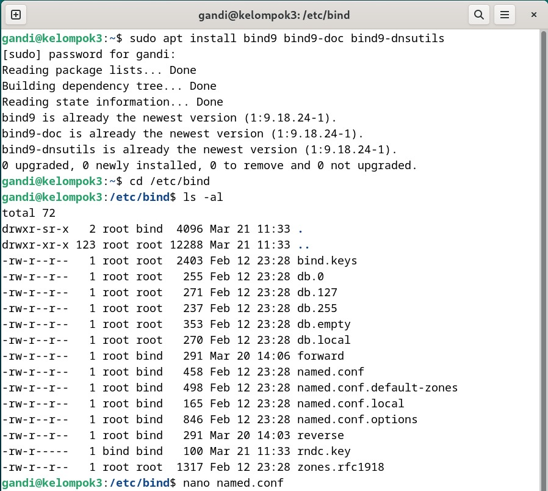 
    <em style="font-size:10px">Gambar 1. Install BIND9</em>

 

### 2. Buka file named.conf
Perintah: `sudo nano /etc/bind/named.conf`

     
    <em style="font-size:10px">Gambar 2. Buka file named.conf</em>

 

### 3. Edit file named.conf

    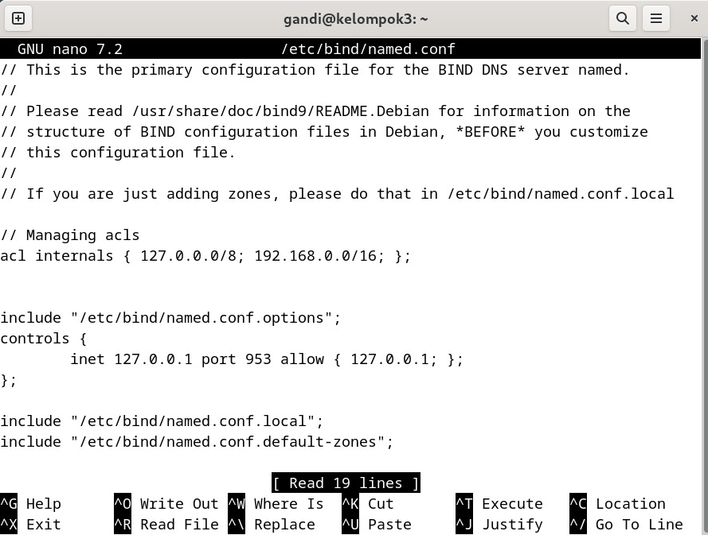 
    <em style="font-size:10px">Gambar 3. Edit file named.conf</em>

 
File ini menentukan akses dari jaringan internal, seperti localhost dan jaringan 192.168.0.0/16. Selain itu, untuk mengelola server dari localhost ke port 953 dan melakukan konfigurasi tambahan dari beberapa file lain yang berisi pengaturan seperti option, local, dan default zone.

### 4. Buka file named.conf.options
Perintah: `sudo nano /etc/bind/named.conf.options`

     
    <em style="font-size:10px">Gambar 4. Buka file named.conf.options</em>

 

### 5. Edit file named.conf.options

    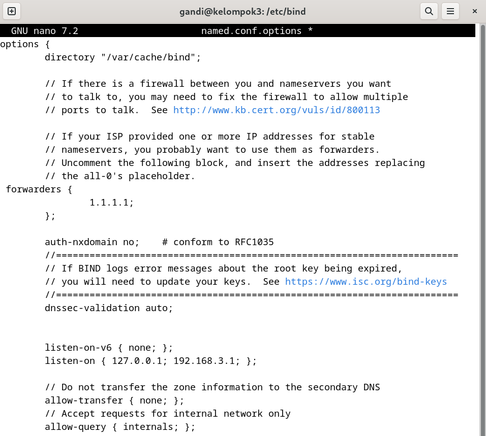 
    <em style="font-size:10px">Gambar 5. Edit file named.conf.options</em>

 
Pada bagian "Forwarding" mengatur server untuk meneruskan permintaan DNS ke server eksternal (1.1.1.1) jika tidak dapat menyelesaikannya sendiri. Sedangkan, bagian "Listen-on" menentukan alamat IP mana server akan mendengarkan permintaan DNS, yaitu 127.0.0.1 dan 192.168.3.1.

### 6. Buka file named.conf.local
Perintah: `sudo nano /etc/bind/named.conf.options`

     
    <em style="font-size:10px">Gambar 6. Buka file named.conf.local</em>

 

### 7. Edit file named.conf.local

    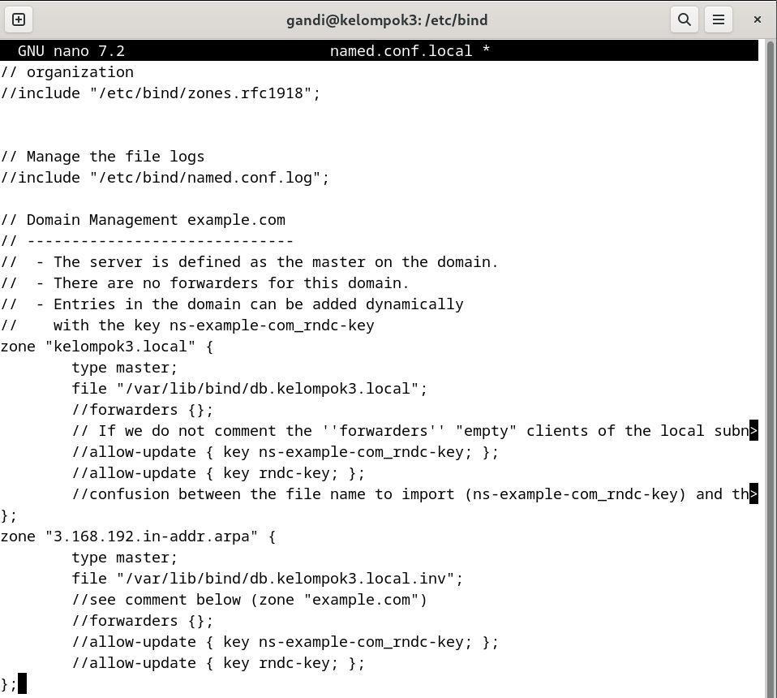 
    <em style="font-size:10px">Gambar 7. Edit file named.conf.local</em>

 
File `named.conf.local` mengatur zona-zona DNS lokal. Dalam konfigurasi ini, ada dua zona yang didefinisikan: "kelompok3.local" dan "3.168.192.in-addr.arpa". Server ditetapkan sebagai master untuk kedua zona tersebut. Informasi DNS disimpan dalam file database yang sesuai, dan konfigurasi juga memungkinkan pembaruan dinamis menggunakan kunci yang sesuai.

### 8. Memeriksa kesalahan sintaks file named.conf
Perintah: `sudo named-checkconf /etc/bind/named.conf`

     
    <em style="font-size:10px">Gambar 8. Memeriksa kesalahan sintaks file named.conf</em>

 

### 9. Buka file db.kelompok3.local
Perintah: `sudo nano /var/lib/bind/db.kelompok3.local`

     
    <em style="font-size:10px">Gambar 9. Buka file db.kelompok3.local</em>

 

### 10. Edit file db.kelompok3.local

    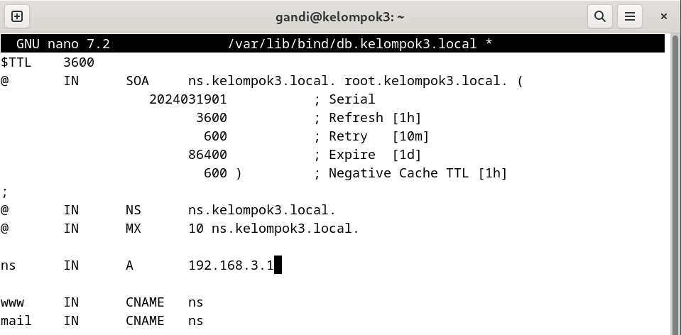 
    <em style="font-size:10px">Gambar 10. Edit file db.kelompok3.local</em>

 
File `db.kelompok3.local` adalah database zona untuk domain "kelompok3.local" dalam server DNS BIND. Dalam konfigurasi ini, terdapat catatan SOA yang menunjukkan server otoritatif dan parameter zona, catatan NS yang menetapkan server name untuk zona, serta catatan MX untuk mail server. Selain itu, terdapat catatan A yang menghubungkan nama `ns` ke alamat IP `192.168.3.1`, dan dua catatan CNAME yang membuat alias `www` dan `mail` menuju `ns`.

### 11. Buka file db.kelompok3.local.inv
Perintah: `sudo nano /var/lib/bind/db.kelompok3.local.inv`

     
    <em style="font-size:10px">Gambar 11. Buka file db.kelompok3.local.inv</em>

 

### 12. Edit file db.kelompok3.local.inv

    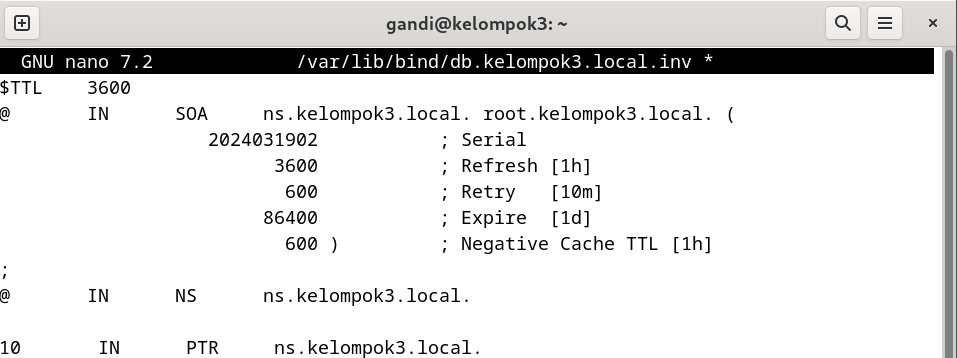 
    <em style="font-size:10px">Gambar 12. Edit file db.kelompok3.local.inv</em>

 
File `db.kelompok3.local.inv` adalah file zona reverse lookup untuk domain "kelompok3.local". Dalam konfigurasi ini, terdapat catatan SOA dan NS yang menunjukkan server otoritatif untuk zona ini adalah `ns.kelompok3.local`. Selain itu, terdapat catatan PTR yang mengaitkan alamat IP dengan nama host `ns.kelompok3.local`.

### 13. Memeriksa kesalahan sintaks file db.kelompok3.local
Perintah: `sudo named-checkzone kelompok3.local db.kelompok3.local`

    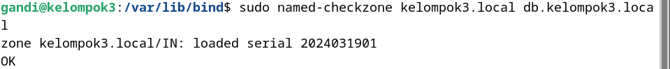 
    <em style="font-size:10px">Gambar 13. Memeriksa kesalahan sintaks file db.kelompok3.local</em>

 

### 14. Memeriksa kesalahan sintaks file db.kelompok3.local.inv
Perintah: `sudo named-checkzone 3.168.192.inaddr-arpa db.kelompok3.local.inv`

    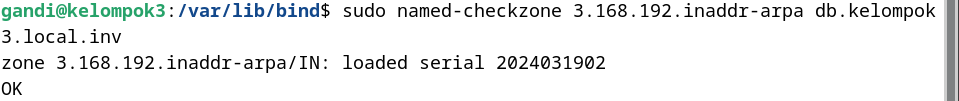 
    <em style="font-size:10px">Gambar 14. Memeriksa kesalahan sintaks file db.kelompok3.local.inv</em>

 

### 15. Buka file resolv.conf
Perintah: `sudo nano /etc/resolv.conf`

     
    <em style="font-size:10px">Gambar 15. Buka file resolv.conf</em>

 

### 16. Edit file resolv.conf

    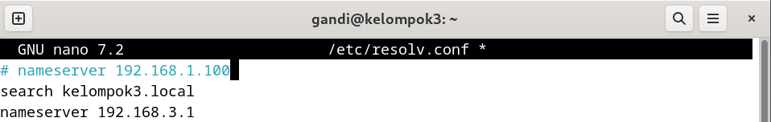 
    <em style="font-size:10px">Gambar 16. Edit file resolv.conf</em>

 
File `db.kelompok3.local.inv` adalah file zona reverse lookup untuk domain "kelompok3.local". Dalam konfigurasi ini, terdapat catatan SOA dan NS yang menunjukkan server otoritatif untuk zona ini adalah `ns.kelompok3.local`. Selain itu, terdapat catatan PTR yang mengaitkan alamat IP dengan nama host `ns.kelompok3.local`.

### 17. Merestart BIND DNS
Perintah: `sudo systemctl restart named`

     
    <em style="font-size:10px">Gambar 17. Merestart BIND DNS</em>

 

### 18. Memeriksa status BIND DNS
Perintah: `sudo systemctl status named`

    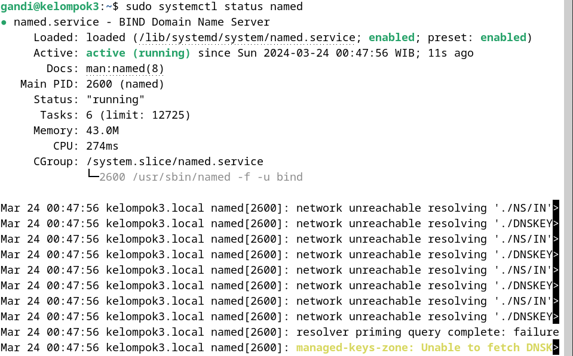 
    <em style="font-size:10px">Gambar 18. Memeriksa status BIND DNS</em>

 

### 19. Melakukan query DNS domain kelompok11.local
Perintah: `dig kelompok3.local`

    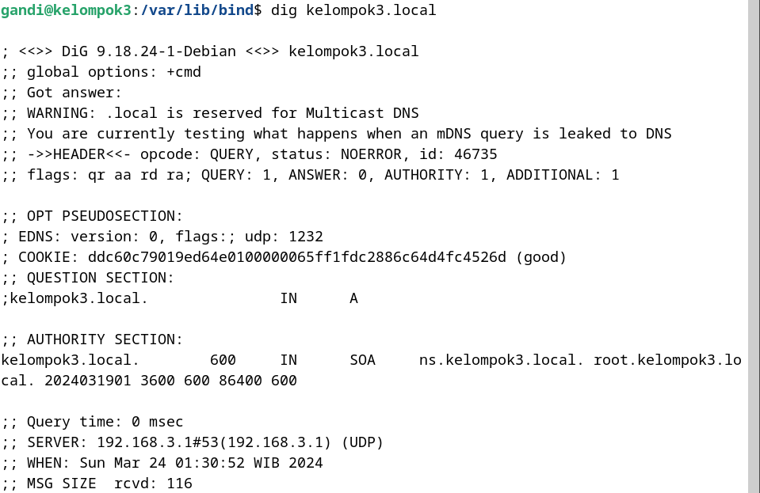 
    <em style="font-size:10px">Gambar 19. Melakukan query DNS domain kelompok3.local</em>

 

### 20. Melakukan reverse DNS lookup alamat IP 192.168.3.1
Perintah: `dig -x 192.168.3.1`

    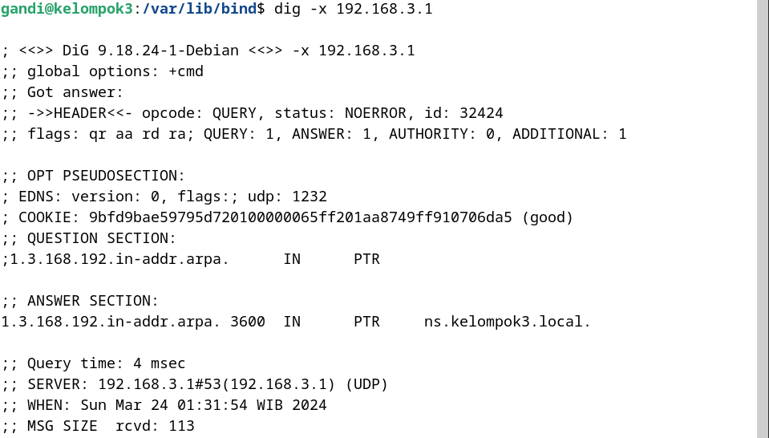 
    <em style="font-size:10px">Gambar 20. Melakukan reverse DNS lookup alamat IP 192.168.3.1</em>

 

### 21. Mencari server DNS domain
Perintah: `nslookup ns`

    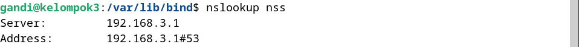 
    <em style="font-size:10px">Gambar 21. Mencari server DNS domain</em>

 
