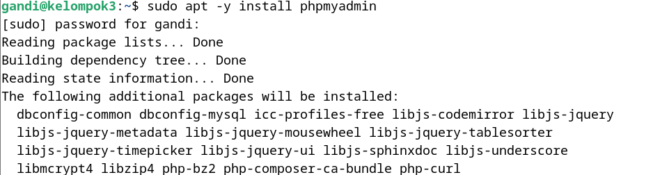
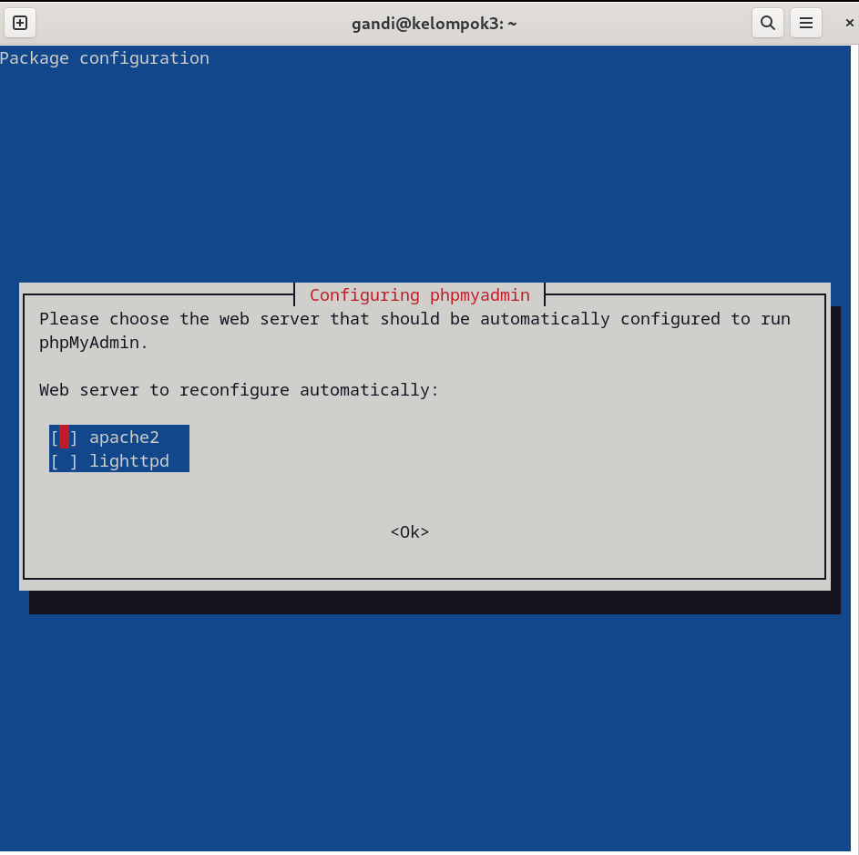
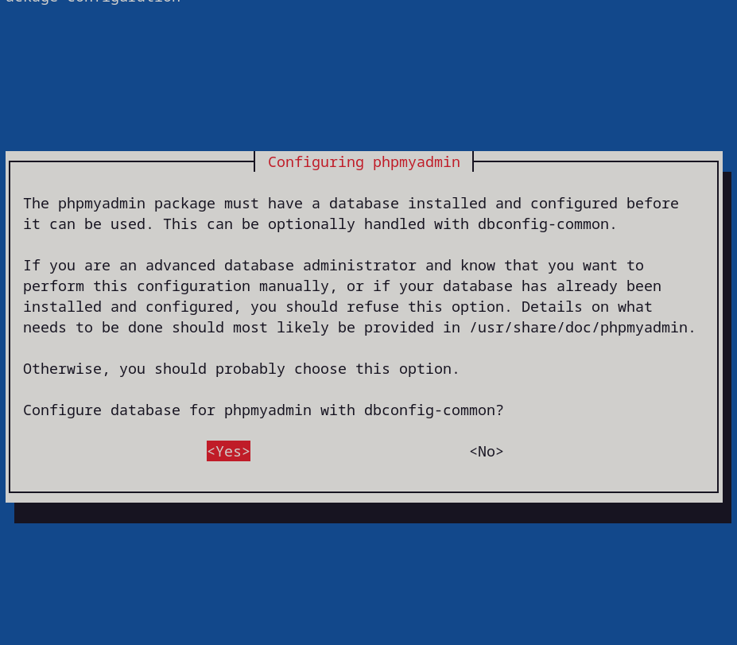
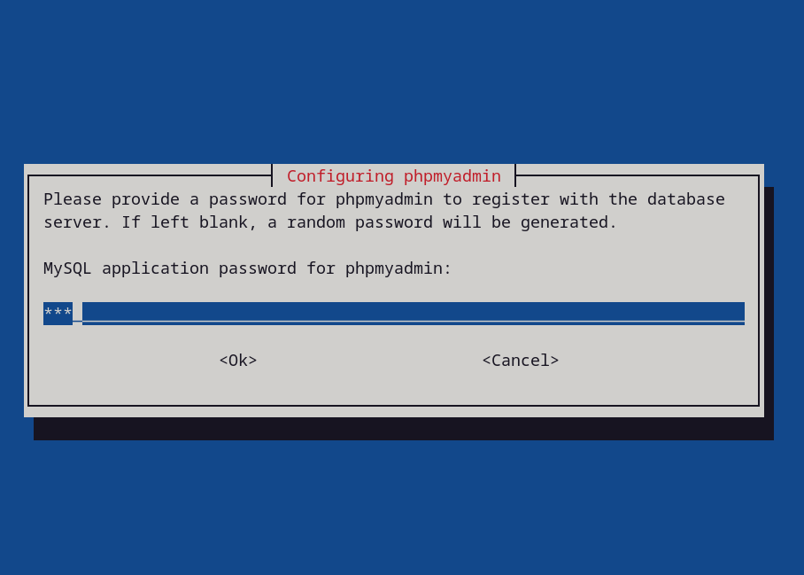
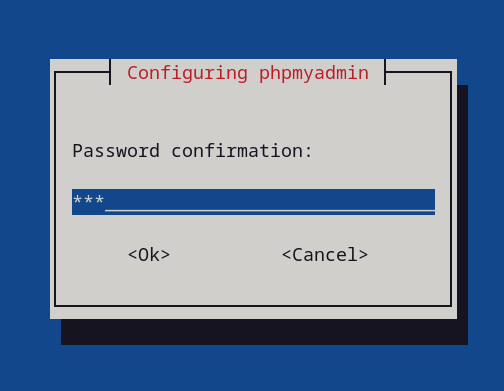
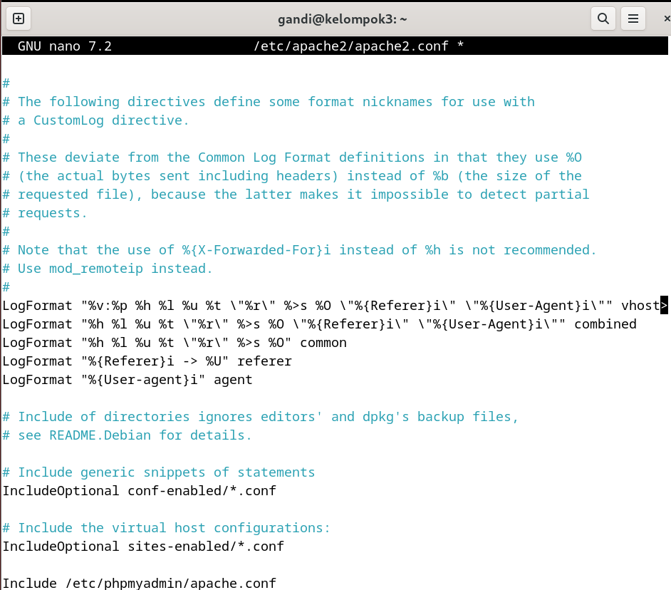
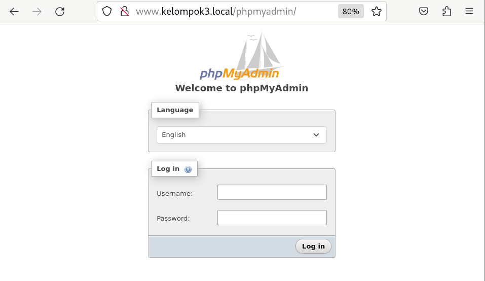
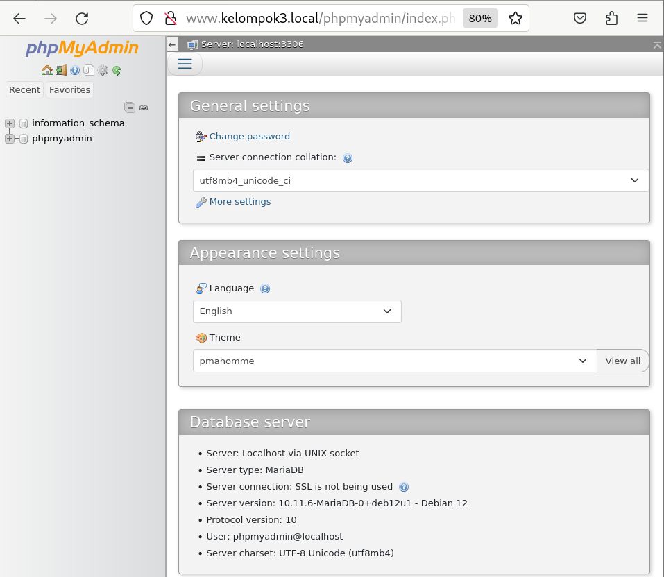
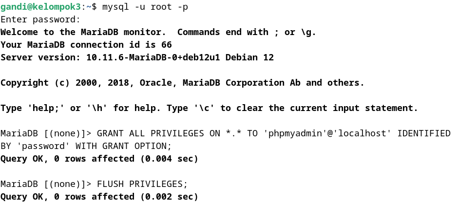
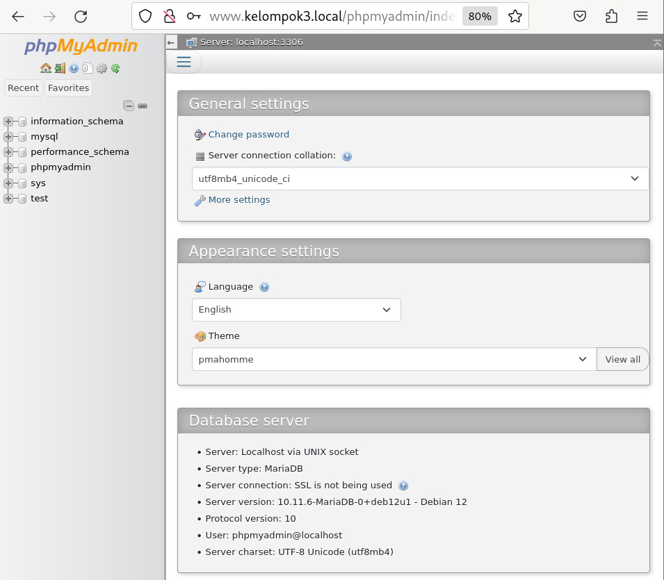

<div align="center">
  <h3 style="text-align: center;font-weight: bold">Praktikum 5<br>Konfigurasi phpMyAdmin</h3>
  <h4 style="text-align: center;">Dosen Pengampu : Dr. Ferry Astika Saputra, S.T., M.Sc.</h4>
</div>
<br />
<div align="center">
  
  <h5 style="text-align: center;">Disusun Oleh :</h5>
  <p style="text-align: center;">
    <strong>Gandi Rukmaning Ayu (3122500016)</strong>
  </p>
<h4 style="text-align: center;line-height: 1.5">Politeknik Elektronika Negeri Surabaya<br>Departemen Teknik Informatika Dan Komputer<br>Program Studi Teknik Informatika</h4>
<h5>2023/2024</h5>
</div>

---

#### 1. Install phpmyadmin
```sudo apt -y install phpmyadmin```
Konfigurasi installasi
- Pilih web server yang digunakan, pada contoh ini menggunakan apache2

<div align="center">
    
    <br>
    <em style="font-size:10px">Gambar 1.1 Install dan konfigurasi phpMyAdmin</em>
</div><br>

- Pilih configure database for phpmyadmin dengan dbconfig-common

<div align="center">
    <br>
    <em style="font-size:10px">Gambar 1.2 Konfigurasi phpMyAdmin</em>
</div><br>

- Masukkan password root phpmyadmin dan konfirmasi password root phpmyadmin

<div align="center">
    
    <br>
    <em style="font-size:10px">Gambar 1.3 Setting password root phpMyAdmin</em>
</div><br>


#### 2. Konfigurasi phpmyadmin pada apache2
```sudo nano /etc/apache2/apache2.conf```
Tambahkan baris berikut pada file konfigurasi apache2 di bagian paling bawah
```
Include /etc/phpmyadmin/apache.conf
```

<div align="center">
    
    <br>
    <em style="font-size:10px">Gambar 2. Konfigurasi phpMyAdmin di Apache2</em>
</div><br>

#### 3. Restart apache2
```sudo systemctl restart apache2```

<div align="center">
    <br>
    <em style="font-size:10px">Gambar 3. Restart Apache2</em>
</div><br>

#### 4. Akses phpmyadmin
Buka browser dan akses phpmyadmin dengan alamat http://kelompok3.local/phpmyadmin

<div align="center">
    <br>
    <em style="font-size:10px">Gambar 4.1 Akses phpMyAdmin</em>
</div><br>

Masukkan username dan password root mysql yang telah diatur sebelumnya
contoh:
- username: phpmyadmin
- password: 123

<div align="center">
    <br>
    <em style="font-size:10px">Gambar 4.2 Login phpMyAdmin</em>
</div><br>

#### 5. menambahkan privilege user phpmyadmin
- login ke mysql ```mysql -u root -p```
- tambahkan privilege user phpmyadmin
```
GRANT ALL PRIVILEGES ON *.* TO 'phpmyadmin'@'localhost' IDENTIFIED BY 'password' WITH GRANT OPTION;
FLUSH PRIVILEGES;
```
Hasilnya kita dapat mengatur database melalui phpmyadmin

<div align="center">
    
    <br>
    <em style="font-size:10px">Gambar 5. Add privilege user</em>
</div><br>