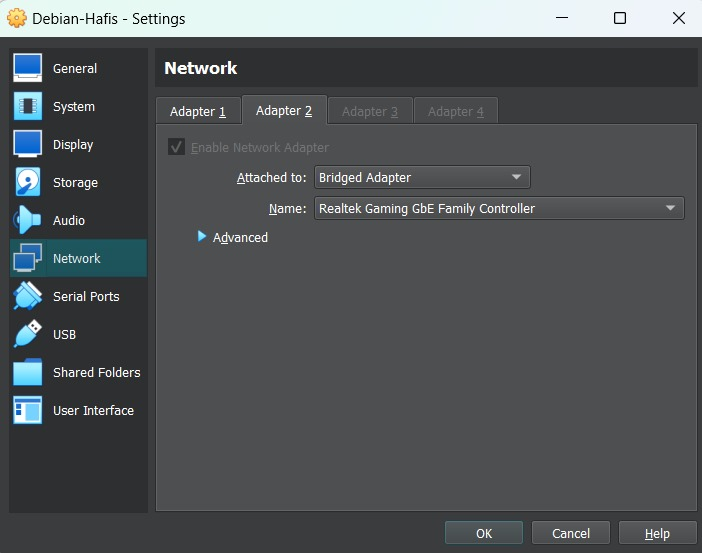
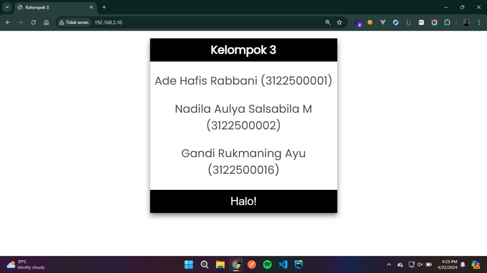
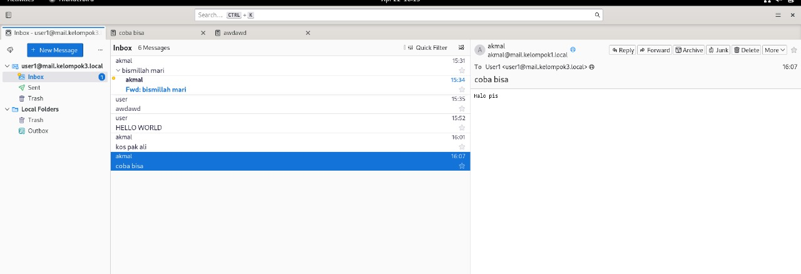

<div align="center">
  <h3 style="text-align: center;font-weight: bold">Praktikum 5<br>Konfigurasi Thunderbird</h3>
  <h4 style="text-align: center;">Dosen Pengampu : Dr. Ferry Astika Saputra, S.T., M.Sc.</h4>
</div>
<br />
<div align="center">
  
  <h5 style="text-align: center;">Disusun Oleh :</h5>
  <p style="text-align: center;">
    <strong>Gandi Rukmaning Ayu (3122500016)</strong>
  </p>
<h4 style="text-align: center;line-height: 1.5">Politeknik Elektronika Negeri Surabaya<br>Departemen Teknik Informatika Dan Komputer<br>Program Studi Teknik Informatika</h4>
<h5>2023/2024</h5>
</div>

---

## 1. Update Debian 12
Sebelum install Thunderbird pastikan Debian 12 sudah diupdate
```sudo apt-get update && sudo apt-get upgrade -y```

## 2. Install Thunderbird
- Buka terminal kemudian jalankan command berikut untuk menginstall Thunderbird
  ```sudo apt install thunderbird```
- Kemudian konfirmasi instalasi dengan menekan tombol ```Y``` dan tekan enter untuk melanjutkan proses instalasi
- Thunderbird telah terinstall pada Debian 12

## 3. Konfigurasi Thunderbird
- Buka Thunderbird melalui pencarian aplikasi
- Setup akun email dengan mengisi kredential dengan alamat email dan password, kemudian klik ```Continue```
- Selanjutnya, akan muncul jendela konfigurasi. IMAP dipilih secara default sebagai protokol. Namun, kita juga bisa menggunakan POP3.
- Klik ```Done``` untuk menyelesaikan konfigurasi email

## 4. Mengubah Interface
Ubah interface thunderbird menjadi Attached to ```Bridge Adapter```


## 5. Menambahkan DNS
Untuk pengaturan IPv4 method pilih Manual, kemudian pada bagian DNS ubah menjadi ```10.10.10.1```


## 6. Forwarder dan Allow-query
Menambahkan forwarder dan merubah allow-query  dan allow-recursion menjadi ```any``` pada file named.conf.options
```sudo nano /etc/bind/named.conf.options```.


## 7. Merubah DNS
Merubah DNS Servers di mikrotik menjadi ```10.10.10.1```


## 7. Testing
- Pengujian Web Server melalui client.
  

- Mencoba mengirim email ke alamat email lain.
  

- Melakukan pengecekan apakah dapat menerima email dari alamat lain.
  
