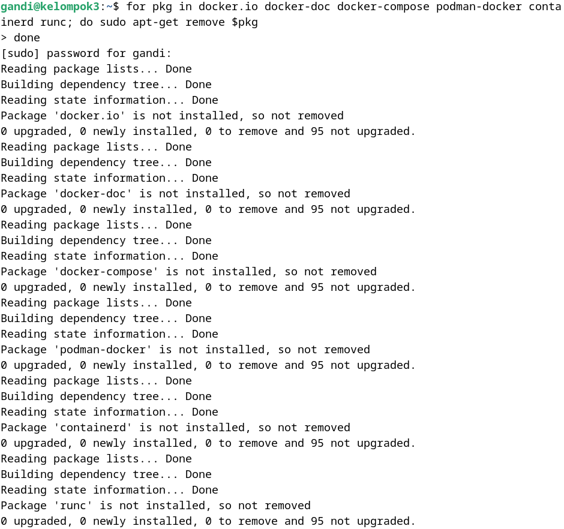
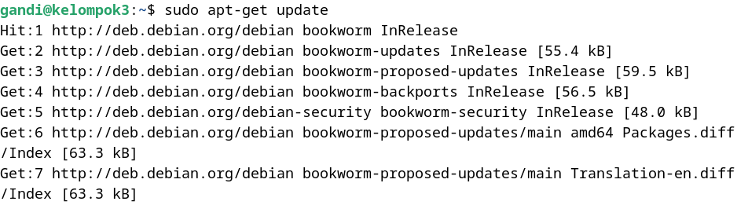
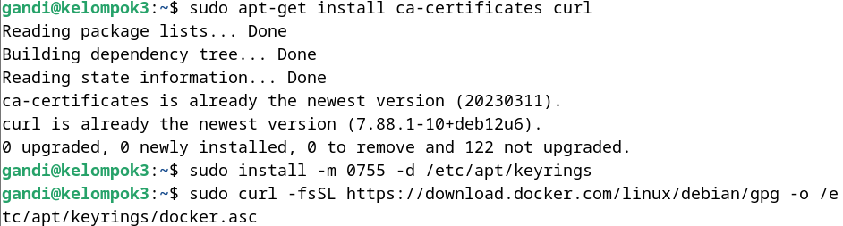
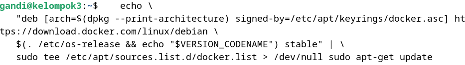
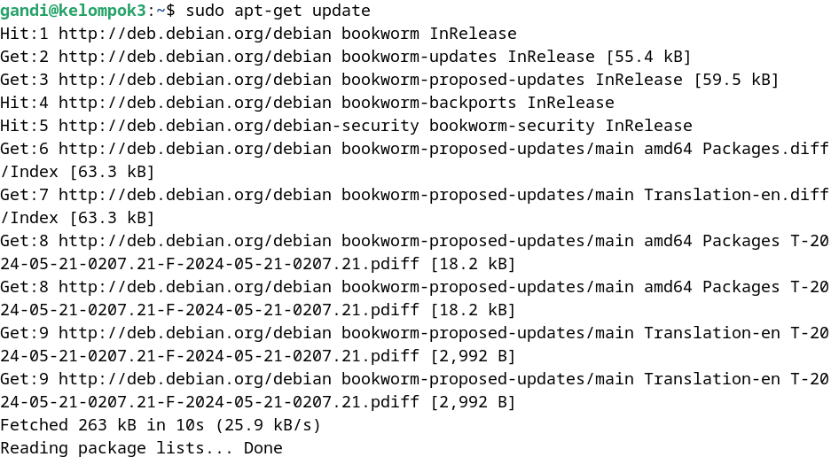
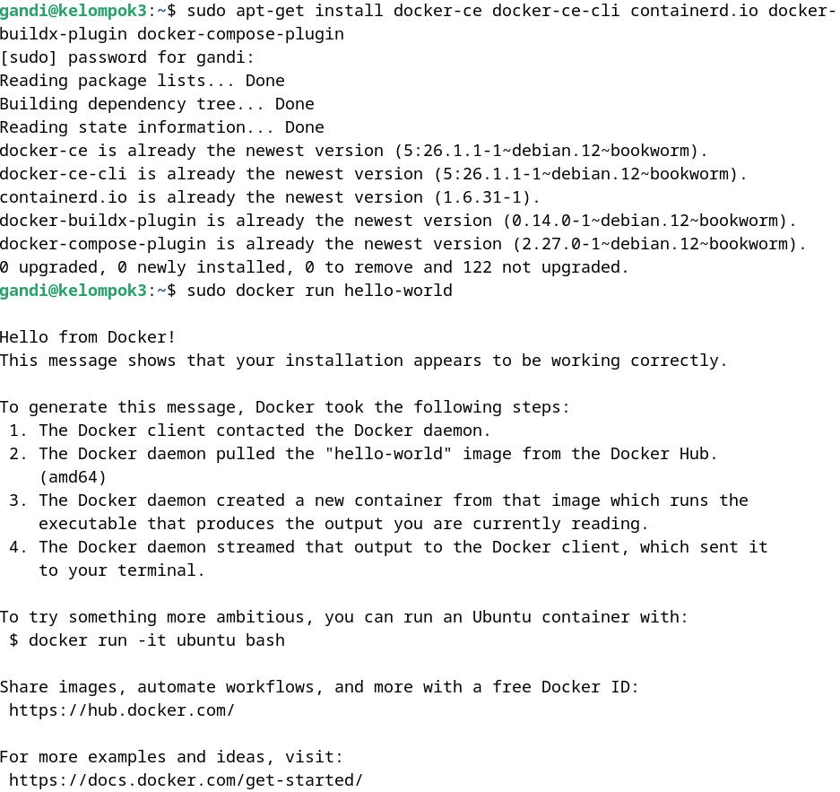

# Docker Uptime Kuma Package
###### Containerized Web Server Using Docker

#### Instalasi Docker di Debian vmBox
1. 
   Hapus beberapa program terkait kontainerisasi di sistem. Perintah ini bekerja dengan melakukan pengulangan untuk setiap program dalam daftar yang meliputi docker.io, docker-doc, docker-compose, podman-docker, containerd, dan runc. Untuk setiap program, skrip menjalankan perintah sudo apt-get remove, yang menghapus program tersebut dari komputer.

2. 
   
   Perintah diatas digunakan untuk mengunduh dan menginstal Docker. Pertama, sudo apt-get update memperbarui daftar paket agar sistem tahu versi terbaru yang tersedia. Kemudian, sudo apt-get install ca-certificates curl menginstal sertifikat dan alat untuk mengunduh file dari internet. Selanjutnya, sudo install -m 0755 -d /etc/apt/keyrings membuat direktori untuk menyimpan kunci keamanan dengan izin akses tertentu. Setelah itu, sudo curl -fsSL https://download.docker.com/linux/debian/gpg -o /etc/apt/keyrings/docker.asc mengunduh kunci GPG Docker ke direktori tersebut. Terakhir, sudo chmod a+r /etc/apt/keyrings/docker.asc mengatur izin agar semua pengguna bisa membaca kunci tersebut.

3. Menambahkan repository Apt Resources
   
   

4. 
   Perintah ini digunakan untuk menginstal Docker di Linux. sudo apt-get install docker-ce docker-ce-cli containerd.io docker-buildx-plugin docker-compose-plugin menginstruksikan sistem untuk mengunduh dan menginstal komponen Docker, termasuk Docker Engine (docker-ce), command-line interface Docker (docker-ce-cli), containerd (komponen container runtime), serta plugin untuk Docker Buildx dan Docker Compose. sudo docker run hello-world menjalankan tes sederhana dengan Docker untuk memastikan bahwa semuanya telah terpasang dengan benar. Docker akan menampilkan pesan "Hello from Docker!" jika semuanya berfungsi dengan baik.
