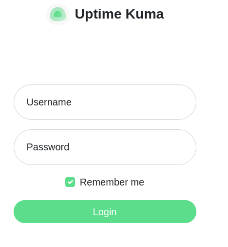
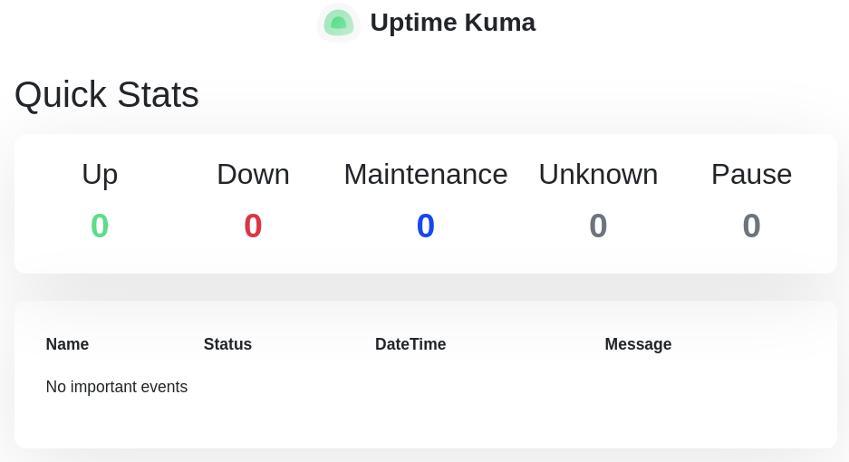
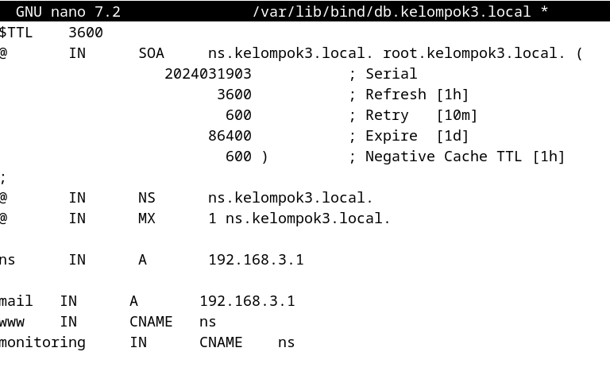
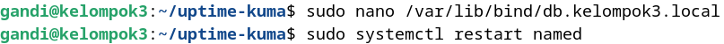
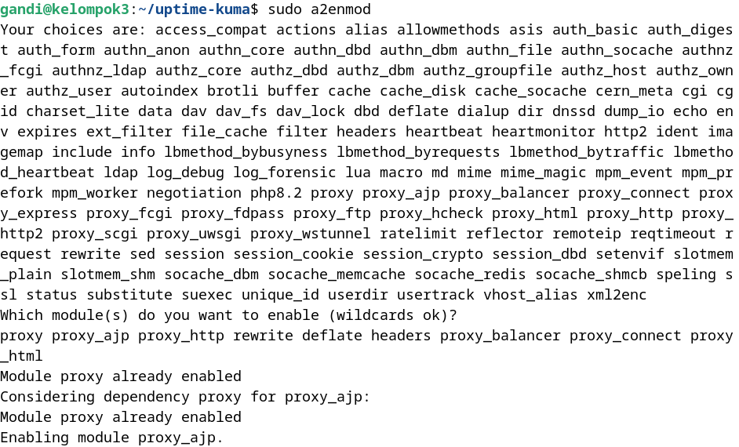
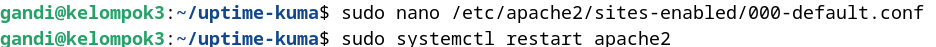
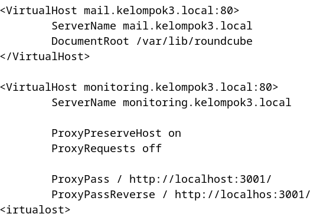
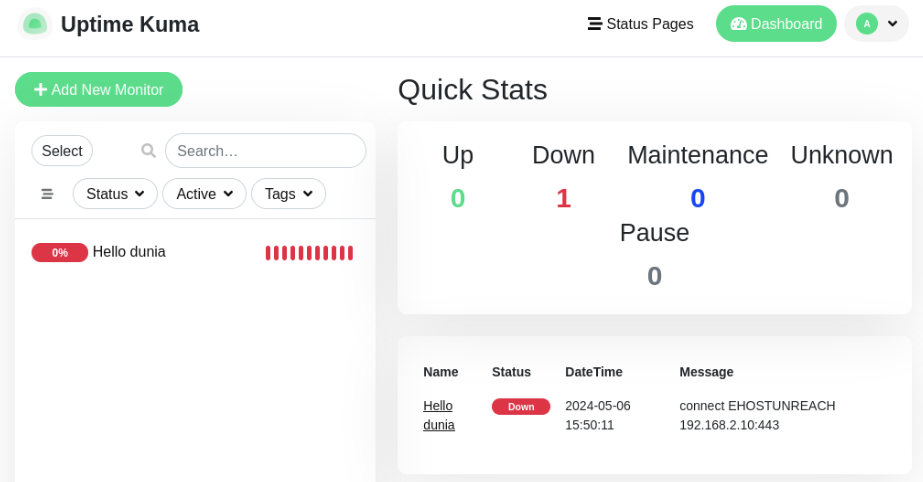

## Docker Uptime Kuma Package

1. Clone Uptime kuma `git clone https://github.com/louislam/uptime-kuma.git`, kemudian pindah ke directory uptime-kuma. Jalankan container menggunakan perintah `sudo docker compose up` dan cek pada pada port 0.0.0.0:3001/dashboard
   
   

2. 
   
   Konfigurasi file db.kelompok3.local dengan menambahkan monitoring pada CNAME ns

3. 
   Perintah sudo a2enmod diikuti dengan daftar modul seperti proxy, proxy_ajp, proxy_http, rewrite, deflate, headers, proxy_balancer, proxy_connect, dan proxy_html digunakan untuk mengaktifkan modul-modul tersebut di server web Apache pada Linux. Modul-modul ini menambah berbagai fungsi ke Apache, seperti kemampuan untuk mengarahkan ulang URL, mengelola header HTTP, mengompresi konten, dan mendukung berbagai jenis proxying (menghubungkan ke server lain melalui Apache).

4. 
   
   Konfigurasi Apache2 dengan menambahkan script seperti gambar diatas untuk memonitoring subdomain.

5. 
   Sudah berhasil