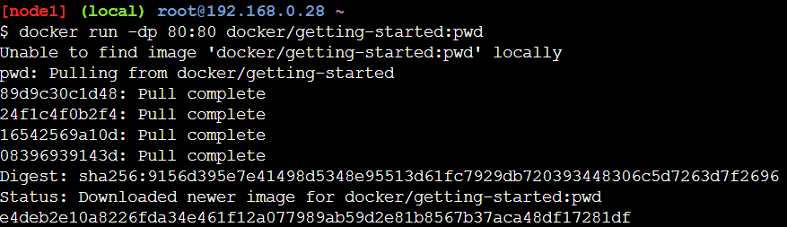
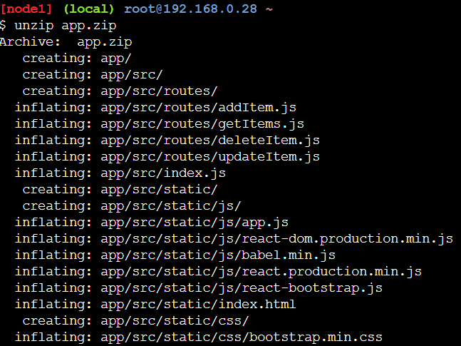
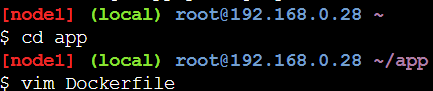
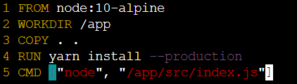
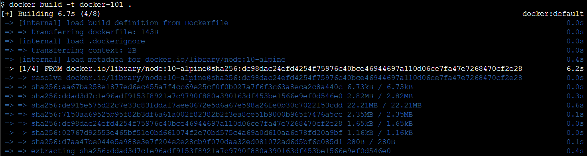
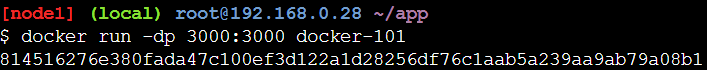

# Getting our App into PWD

1. Ketikkan perintah PWD di terminal 
    ```docker run -dp 80:80 docker/getting-started:pwd```
    

2. Download file app.zip

3. Drag file app.zip ke dalam terminal, kemudian unzip file tersebut
```unzip app.zip```
    

4. Pindah ke directory app dan buat file Dockerfile
    ```vim Dockerfile```
    

5. Isi file tersebut dengan script dibawah ini
    ```
    FROM node:18-alpine
    WORKDIR /app
    COPY . .
    RUN yarn install --production
    CMD ["node", "src/index.js"]
    ```
    

6. Build Docker image menggunakan perintah
```docker build -t docker-101 .```
    

7. Run Docker image pada port 3000 dengan perintah
```docker run -dp 3000:3000 docker-101```
    

8. Buka port 3000 dari instance PWD:
```http://ip172-18-0-84-cp5juq291nsg00a85jog-3000.direct.labs.play-with-docker.com/```
    