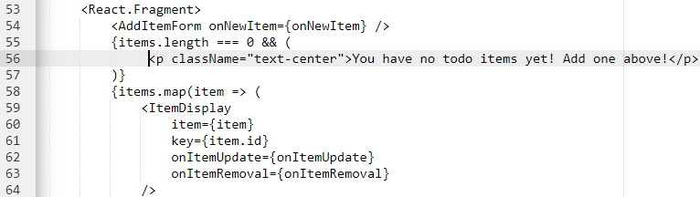
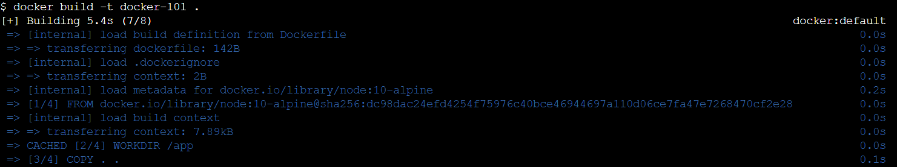
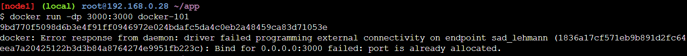
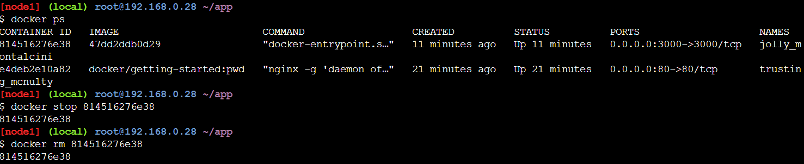
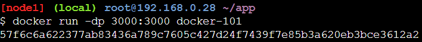
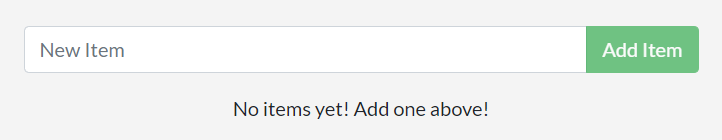

# Updating our source code

1. Edit file `src/static/js/app.js` pada baris ke 56 menjadi
    ```
    <p className="text-center">You have no todo items yet! Add one above!</p>
    ```
    

2. Build image yang telah diupdate dengan perintah
    ```
    docker build -t docker-101 .
    ```
    

3. Jalankan image yang telah diupdate
    ```
    docker run -d -p 3000:3000 getting-started
    ```
    Pasti akan muncul pesan error seperti dibawah ini. Hal ini terjadi karena sudah terdapat port 3000
    ```
    docker: Error response from daemon: driver failed programming external connectivity on endpoint laughing_burnell (bb242b2ca4d67eba76e79474fb36bb5125708ebdabd7f45c8eaf16caaabde9dd): Bind for 0.0.0.0:3000 failed: port is already allocated.
    ```
    

4. Lihat container yang sedang berjalan
    ```
    docker ps
    CONTAINER ID   IMAGE            COMMAND                  CREATED          STATUS          PORTS                    NAMES
    <container_id> getting-started "docker-entrypoint.s…"   1 minute ago     Up 1 minute
    ```

5. Hentikan dan hapus container yang sedang berjalan berdasarkan ID Container
    ```
    docker stop <container_id>
    ```
    

6. Run image yang telah diupdate seperti sebelumnya
    ```
    docker run -dp 3000:3000 docker-101
    ```
    

7. Buka port 3000 dari instance PWD:
    ```
    http://ip172-18-0-84-cp5juq291nsg00a85jog-3000.direct.labs.play-with-docker.com/
    ```
    