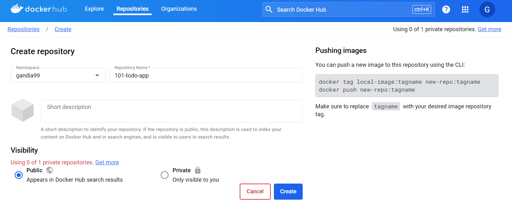
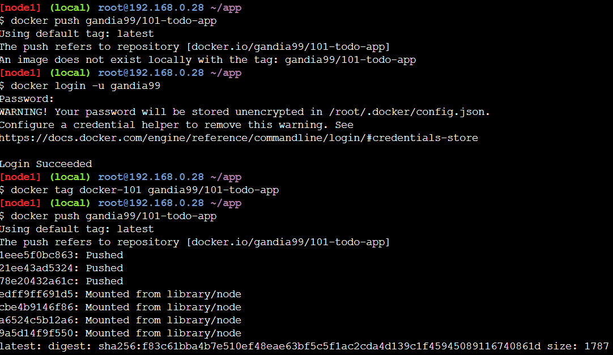
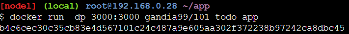

# Sharing Our Apps

1. Buka Docker Hub: [https://hub.docker.com/](https://hub.docker.com/) dan login. Buat repository baru dengan nama `101-todo-app`. Setting visibility menjadi `Public` dan klik `Create`. 
   

2. Push image ke Docker Hub:
   ```bash
   docker tag docker-101 YOUR-USER-NAME/101-todo-app
   docker push YOUR-USER-NAME/101-todo-app
   ```
   

3. Buat instance baru di PWD dan jalankan image yang telah di-push:
   ```bash
   docker run -dp 3000:3000 YOUR-USER-NAME/101-todo-app
   ```
   

4. Buka port 3000 dari instance PWD:
   ```bash
    http://ip172-18-0-84-cp5juq291nsg00a85jog-3000.direct.labs.play-with-docker.com/
    ```
