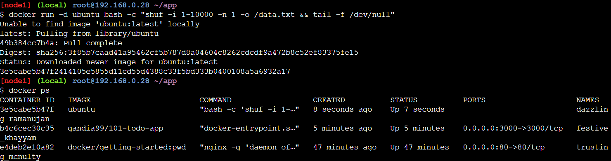
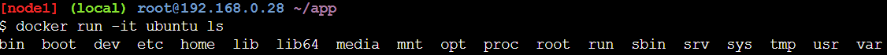
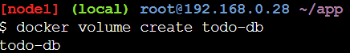
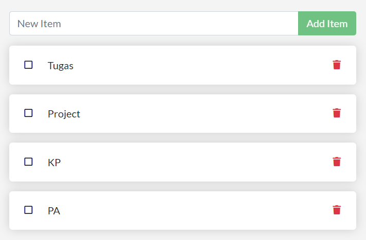
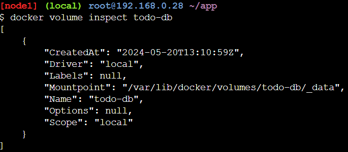

# Presisting Our Database

1. Jalankan container ubuntu dan buat file `data.txt`. Lihat apakah image ubuntu sudah berjalan di container
    ```bash
    docker run -d ubuntu bash -c "shuf -i 1-10000 -n 1 -o /data.txt && tail -f /dev/null"
    docker ps
    ```
    

2. Buat container ubuntu yang lain dan kita akan melihat bahwa file `data.txt` tidak ada
    ```bash
    docker run -it ubuntu ls
    ```
    

3. Kembali dan hapus container yang pertama
    ```bash
    docker rm -f <container_id>
    ```
    

4. Buat volume dengan menggunakan ```docker volume create```
    ```bash
    docker volume create todo-db
    ```
    

5. Hentikan todo-app yang berjalan
    ```bash
    docker stop <container_id>
    ```

6. Jalankan todo-app dengan volume yang telah dibuat tapi dengan menambahkan atribut ```-v```
    ```bash
    docker run -d -p 3000:3000 -v todo-db:/etc/todos getting-started
    ```
    

7. inspect volume yang telah dibuat
    ```bash
    docker volume inspect todo-db
    ```
    
