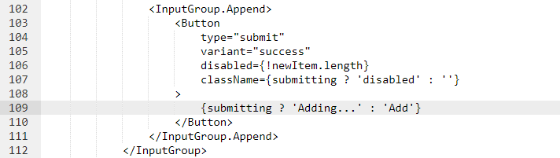

# Using Bind Mounts

1. Pastikan bahwa kita tidak punya container 101-todo-app yang berjalan, kemudian jalankan container 101-todo-app dengan menggunakan port 3000
    ```bash
    docker run -dp 3000:3000 \
    -w /app -v $(pwd):/app \
    node:12-alpine \
    sh -c "yarn install && yarn run dev"
    ```
    

2. Kita bisa melihat log dari container 101-todo-app
    ```bash
    docker logs <container_id>
    ```
    

3. Mengubah file `src/static/js/app.js` pada baris ke 109
    ```bash
    vim src/static/js/app.js
    ```
    

4. Refresh browser untuk melihat perubahannya
    