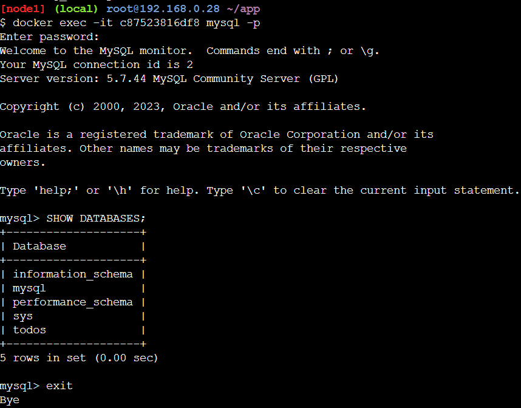

# Multi Container Apps

1. Membuat network dan jalankan mysql container dan tambahkan ke network todo-app
    ```bash
    docker network create todo-app
    docker run -d \
    --network todo-app --network-alias mysql \
    -v todo-mysql-data:/var/lib/mysql \
    -e MYSQL_ROOT_PASSWORD=secret \
    -e MYSQL_DATABASE=todos \
    mysql:8.0
    ```
    

2. Lihat apakah sudah terdapat database `todos`
    ```bash
    docker exec -it <container_id> mysql -p
    ```
    

3. Jalankan container baru dengan nicolaka/netshoot image dan lihat apakah mysql sudah berjalan di dalam container netshoot
    ```bash
    docker run -it --network todo-app nicolaka/netshoot
    dig mysql
    ```
    

4. Konfigurasi aplikasi todo-app dan hubungkan dengan mysql
    ```bash
    docker run -dp 3000:3000 \
    -w /app -v $(pwd):/app \
    --network todo-app \
    -e MYSQL_HOST=mysql \
    -e MYSQL_USER=root \
    -e MYSQL_PASSWORD=secret \
    -e MYSQL_DB=todos \
    node:12-alpine \
    sh -c "yarn install && yarn run dev"
    ```
    

5. Lihat item tabel todos untuk memastikan sudah terhubung ke database
    