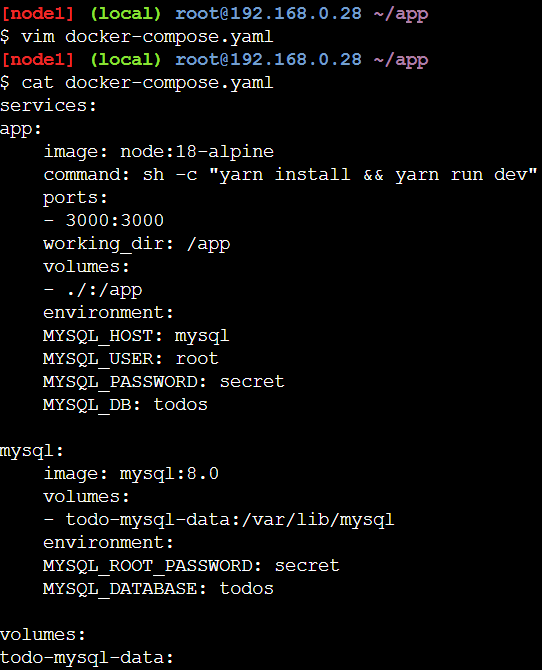

# Using Docker Compose

1. Pada directory app buat file `docker-compose.yml` yang berisi:
    ```yml
    services:
    app:
        image: node:18-alpine
        command: sh -c "yarn install && yarn run dev"
        ports:
        - 3000:3000
        working_dir: /app
        volumes:
        - ./:/app
        environment:
        MYSQL_HOST: mysql
        MYSQL_USER: root
        MYSQL_PASSWORD: secret
        MYSQL_DB: todos

    mysql:
        image: mysql:8.0
        volumes:
        - todo-mysql-data:/var/lib/mysql
        environment: 
        MYSQL_ROOT_PASSWORD: secret
        MYSQL_DATABASE: todos

    volumes:
    todo-mysql-data:
    ```
    

2. Jalankan command
    ```bash
    docker-compose up
    ```

3. Lihat container yang sedang berjalan saat ini
    ```bash
    docker ps
    ```
    
