<div align="center">
  <h3 style="text-align: center;font-weight: bold">Praktikum 5<br>Konfigurasi Database Server</h3>
  <h4 style="text-align: center;">Dosen Pengampu : Dr. Ferry Astika Saputra, S.T., M.Sc.</h4>
</div>
<br />
<div align="center">
  
  <h5 style="text-align: center;">Disusun Oleh :</h5>
  <p style="text-align: center;">
    <strong>Gandi Rukmaning Ayu (3122500016)</strong>
  </p>
<h4 style="text-align: center;line-height: 1.5">Politeknik Elektronika Negeri Surabaya<br>Departemen Teknik Informatika Dan Komputer<br>Program Studi Teknik Informatika</h4>
<h5>2023/2024</h5>
</div>

---

#### 1. Install MariaDB
```sudo apt -y install mariadb-server```

<div align="center">
    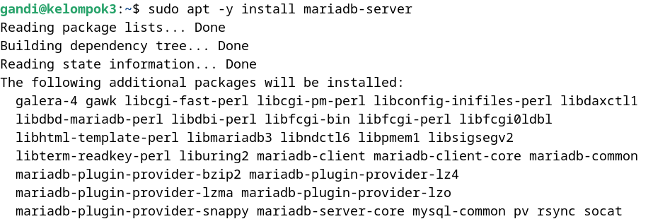<br>
    <em style="font-size:10px">Gambar 1. Install MariaDB</em>
</div><br>

#### 2. Konfigurasi MariaDB
```sudo nano /etc/mysql/mariadb.conf.d/50-server.cnf```
Pastikan character-set-server = utf8mb4

<div align="center">
    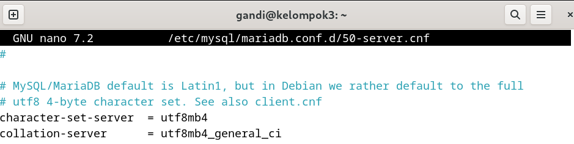<br>
    <em style="font-size:10px">Gambar 2. Konfigurasi MariaDB</em>
</div><br>

#### 3. Inisial Konfigurasi dan testing database MariaDB Server
```sudo mysql_secure_installation```

Isikan konfigurasi inisial seperti berikut:

- Enter current password for root (enter for none): Just press the Enter : (isi password root)
- Switch to unix_socket authentication [Y/n] : n
- Remove anonymous users? [Y/n] : Y
- Disallow root login remotely? [Y/n] : Y
- Remove test database and access to it? [Y/n] : Y
- Reload privilege tables now? [Y/n] : Y

<div align="center">
    
    
    
    
    
    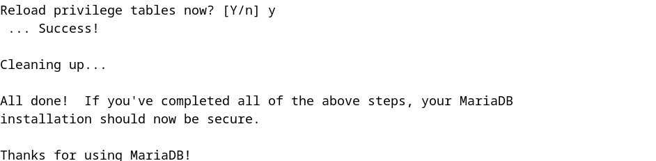<br>
    <em style="font-size:10px">Gambar 3. Konfigurasi dan testing MariaDB Server</em>
</div><br>
  
#### 4. Login ke MariaDB
```sudo mysql -u root -p```

Masukkan password yang sudah di set pada saat konfigurasi inisialisasi

<div align="center">
    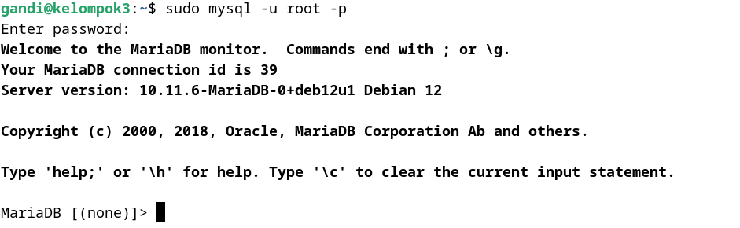<br>
    <em style="font-size:10px">Gambar 4. Login ke MariaDB</em>
</div><br>

#### 5. Uji Coba Database
- Tampilkan hak akses user root

    ```show grants for 'root'@'localhost';```

<div align="center">
    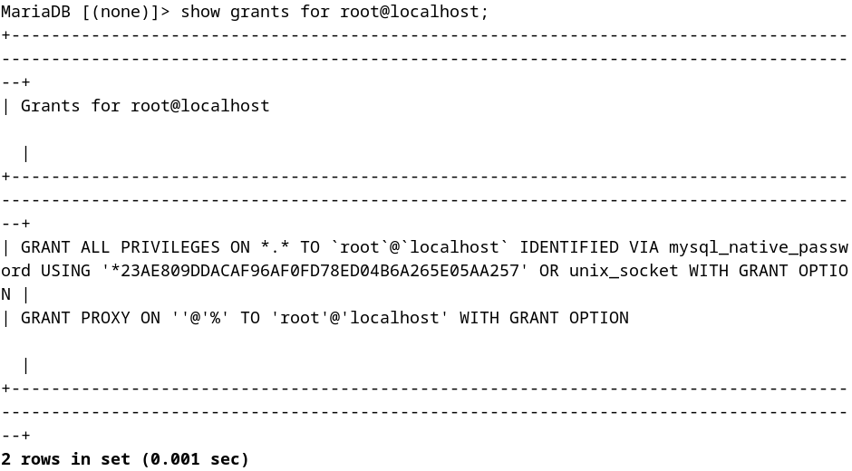<br>
    <em style="font-size:10px">Gambar 4.1 Hak akses user root</em>
</div><br>

- Tampilkan user,host dan password dari db mysql dan tabel user

    ```select user,host,password from mysql.user;```

<div align="center">
    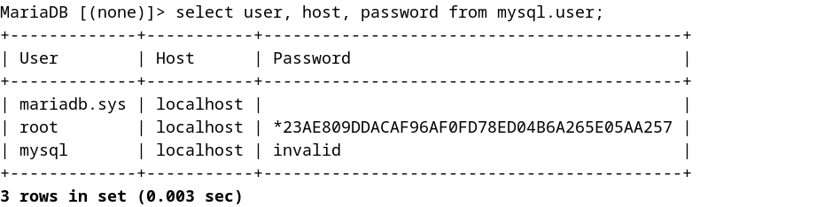<br>
    <em style="font-size:10px">Gambar 4.2 User, host dan password</em>
</div><br>

- Tampilkan database yang ada

    ```show databases;```

<div align="center">
    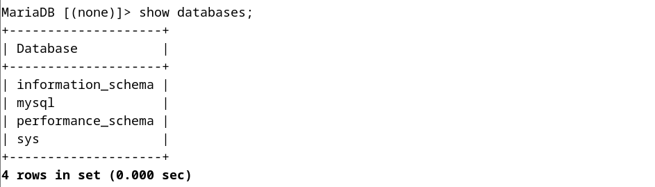<br>
    <em style="font-size:10px">Gambar 4.3 Database</em>
</div><br>

- Buat database baru

    ```create database test;```

<div align="center">
    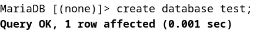<br>
    <em style="font-size:10px">Gambar 4.4 Buat Database</em>
</div><br>

- Buat tabel baru

    - ```use test;```

    - ```create table test.test_table (id int, name varchar(50), address varchar(50), primary key (id));```

<div align="center">
    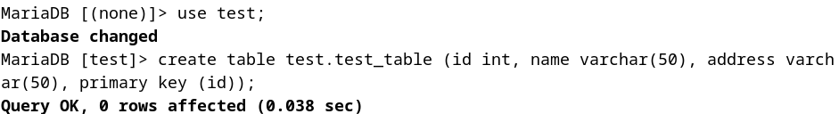<br>
    <em style="font-size:10px">Gambar 4.5 Buat tabel</em>
</div><br>

- Tambahkan data ke tabel

    ```insert into test_table values (1, 'test', 'test address');```

<div align="center">
    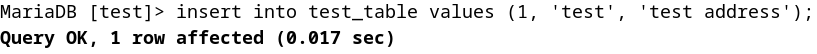<br>
    <em style="font-size:10px">Gambar 4.6 Tambah data tabel baru</em>
</div><br>

- Tampilkan data dari tabel

    ```select * from test_table;```

<div align="center">
    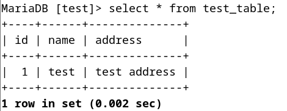<br>
    <em style="font-size:10px">Gambar 4.7 Menampilkan data</em>
</div><br>

- Keluar dari database

    ```exit```

<div align="center">
    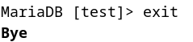<br>
    <em style="font-size:10px">Gambar 4.8 Keluar Database</em>
</div><br>