<div align="center">
  <h3 style="text-align: center;font-weight: bold">Praktikum 5<br>Konfigurasi Mail Server</h3>
  <h4 style="text-align: center;">Dosen Pengampu : Dr. Ferry Astika Saputra, S.T., M.Sc.</h4>
</div>
<br />
<div align="center">
  
  <h5 style="text-align: center;">Disusun Oleh :</h5>
  <p style="text-align: center;">
    <strong>Gandi Rukmaning Ayu (3122500016)</strong>
  </p>
<h4 style="text-align: center;line-height: 1.5">Politeknik Elektronika Negeri Surabaya<br>Departemen Teknik Informatika Dan Komputer<br>Program Studi Teknik Informatika</h4>
<h5>2023/2024</h5>
</div>

---

#### 1. Install Postfix
```apt -y install postfix sasl2-bin```
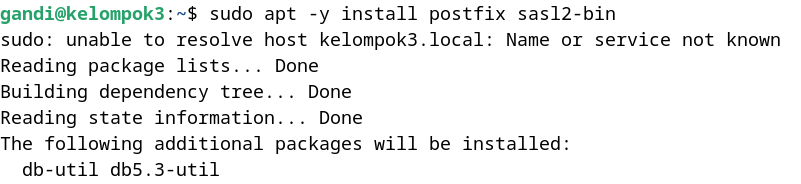
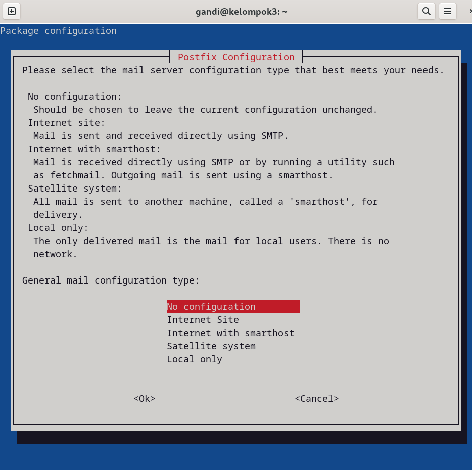

#### 2. copy file main.cf
``` cp /usr/share/postfix/main.cf.dist /etc/postfix/main.cf```


#### 3. Edit file main.cf
```sudo nano /etc/postfix/main.cf```


Lakukan perubahan pada file main.cf seperti berikut:
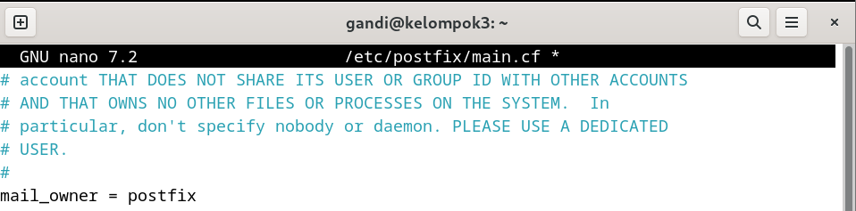<hr>
<hr>
<hr>
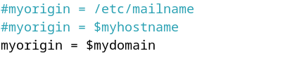<hr>
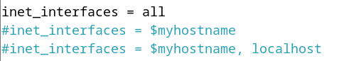<hr>
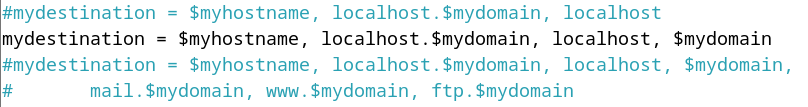<hr>
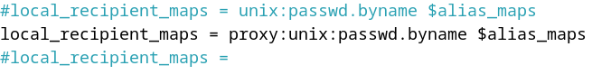<hr>
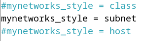<hr>
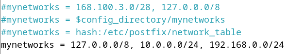<hr>
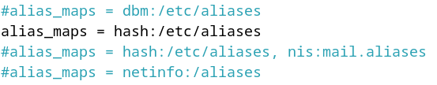<hr>
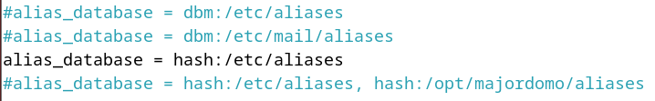<hr>
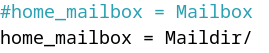<hr>
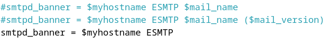<hr>
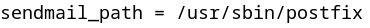<hr>
<hr>
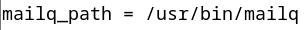<hr>
<hr>
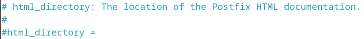<hr>
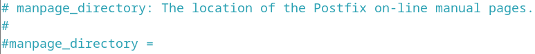<hr>
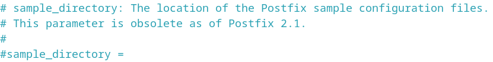<hr>
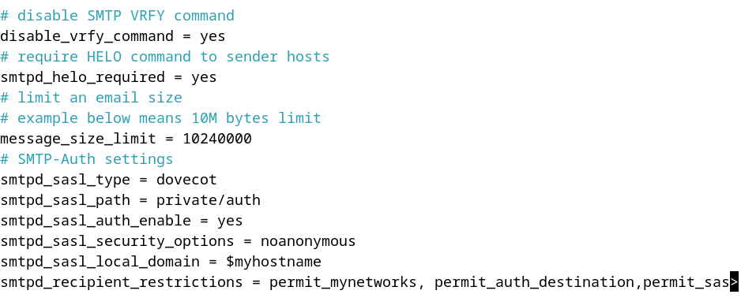

#### 4. Perbarui database aliases postfix 
digunakan untuk memperbarui basis data alias alamat email dalam sistem. Dalam sistem pengiriman email pada Unix dan Linux, file aliases digunakan untuk menentukan alamat mana yang harus dikirimkan ke mana. Perintah newaliases digunakan untuk memperbarui file aliases.db setelah mengubah atau menambahkan entri dalam file aliases.

```sudo newaliases```
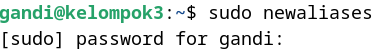

#### 5. Restart postfix
```systemctl restart postfix```

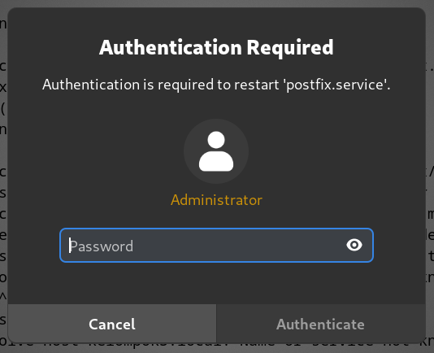

#### 6. Menambahkan konfigurasi anti spam
buka file main.cf
```sudo nano /etc/postfix/main.cf```


tambahkan baris berikut di paling bawah
```
# reject unknown clients that forward lookup and reverse lookup of their hostnames on DNS do not match
smtpd_client_restrictions = permit_mynetworks, reject_unknown_client_hostname, permit

# rejects senders that domain name set in FROM are not registered in DNS or
# not registered with FQDN
smtpd_sender_restrictions = permit_mynetworks, reject_unknown_sender_domain,reject_non_fqdn_sender

# reject hosts that domain name set in FROM are not registered in DNS or
# not registered with FQDN when your SMTP server receives HELO command
smtpd_helo_restrictions = permit_mynetworks, reject_unknown_hostname,reject_non_fqdn_hostname, reject_invalid_hostname, permit
```
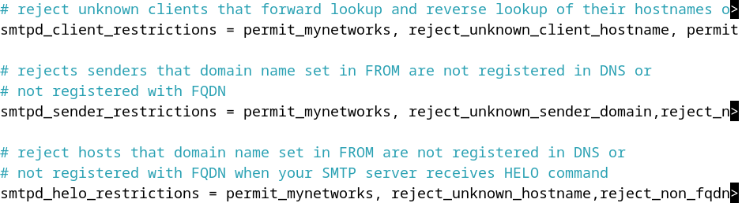

restart postfix
```systemctl restart postfix```

#### 7. Install Dovecot
```sudo apt -y install dovecot-core dovecot-pop3d dovecot-imapd```
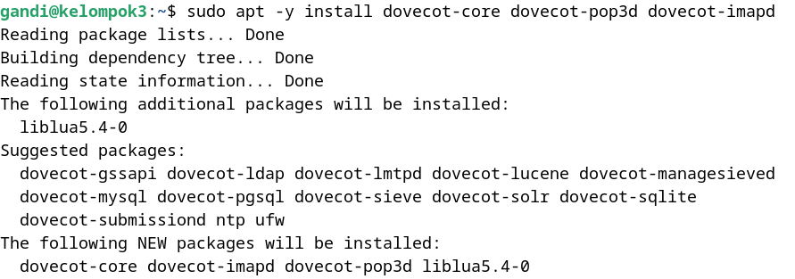

#### 8. Konfigurasi Dovecot
- Edit file /etc/dovecot/dovecot.conf
    ```sudo nano /etc/dovecot/dovecot.conf```
    uncomment baris 30

    
    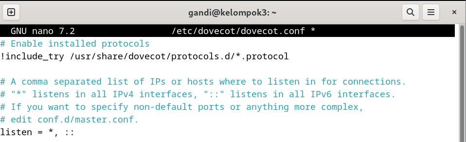

- Edit file /etc/dovecot/conf.d/10-auth.conf
    ```sudo nano /etc/dovecot/conf.d/10-auth.conf```
    uncomment baris 10 dan setting ke ```no```

    ubah di baris 100 menjadi ```disable_plaintext_auth = plain login```

    
    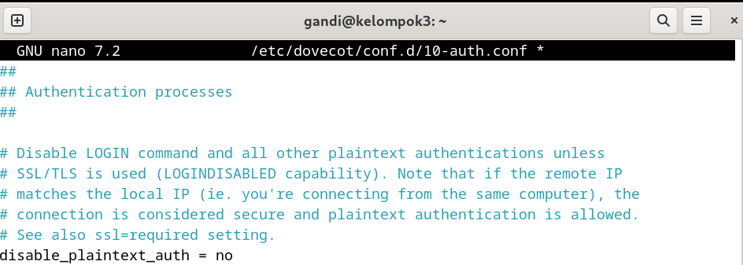
    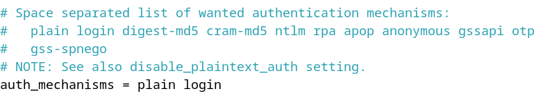

- Edit file  /etc/dovecot/conf.d/10-mail.conf
  ```sudo nano /etc/dovecot/conf.d/10-mail.conf```
    uncomment baris 30 dan ubah menjadi ```mail_location = maildir:~/Maildir```

    
    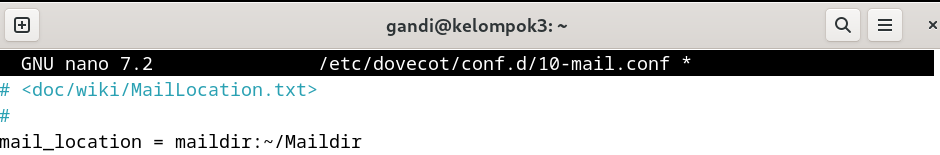

- Edit file /etc/dovecot/conf.d/10-master.conf
    ```sudo nano /etc/dovecot/conf.d/10-master.conf```
    uncomment baris 107-109
    dan ubah seperti berikut
    ```
    unix_listener /var/spool/postfix/private/auth {
        mode = 0666
        user = postfix
        group = postfix
    }
    ```

    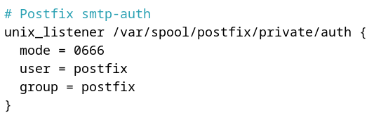

#### 9. Restart Dovecot
```systemctl restart dovecot```
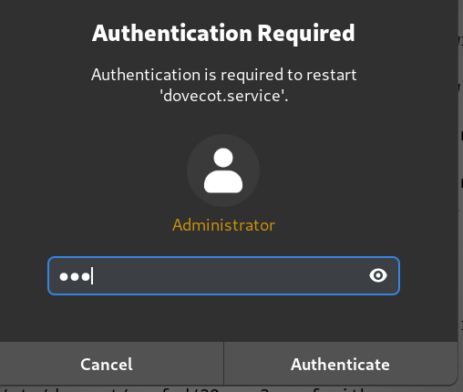

#### 10. Final Check
``` netstat -a| grep LISTEN```
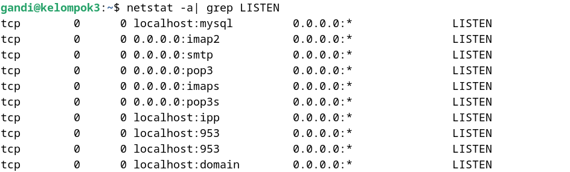
Pastikan Service MariaDB(MySQL), IMAP, POP3, DNS(domain), IMAPS, POP3S, SSH, Postfix (SMTP)

#### 11. Testing
``` telnet mail.kelompok3.local 22 ``` (gunakan port yang sesuai dengan port ssh yang dibuka)
    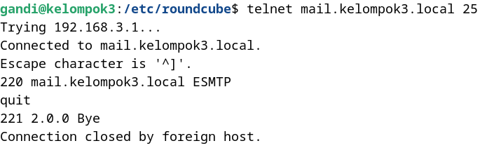