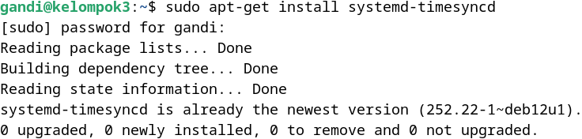
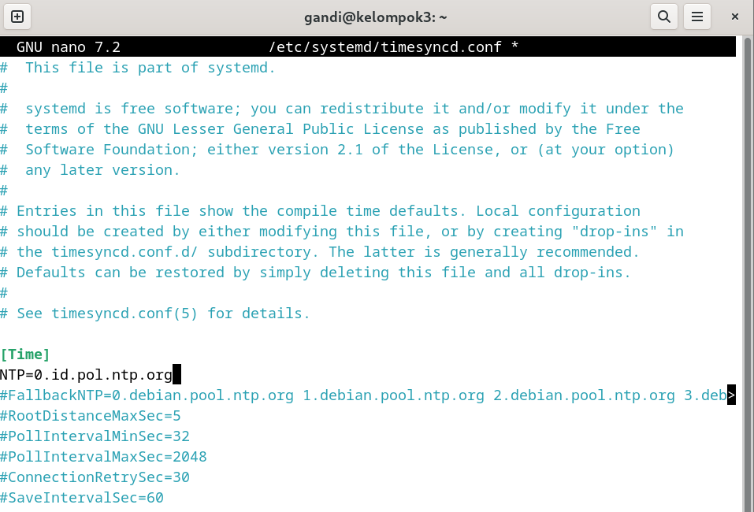
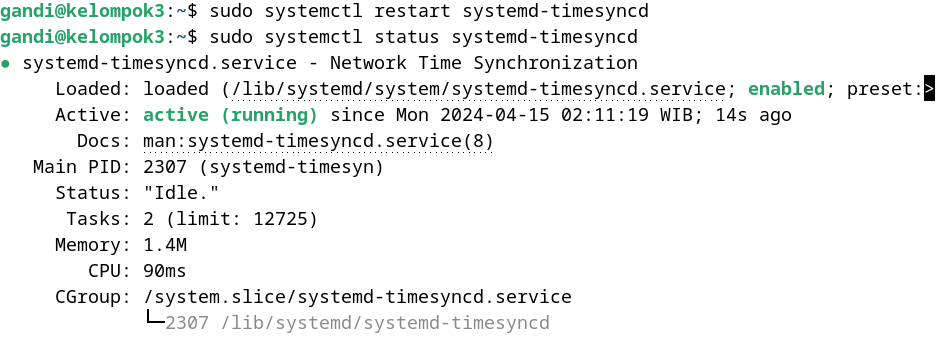
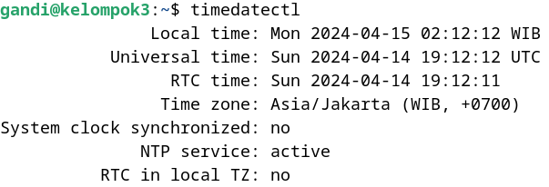

<div align="center">
  <h3 style="text-align: center;font-weight: bold">Praktikum 5<br>Konfigurasi NTP Server</h3>
  <h4 style="text-align: center;">Dosen Pengampu : Dr. Ferry Astika Saputra, S.T., M.Sc.</h4>
</div>
<br />
<div align="center">
  
  <h5 style="text-align: center;">Disusun Oleh :</h5>
  <p style="text-align: center;">
    <strong>Gandi Rukmaning Ayu (3122500016)</strong>
  </p>
<h4 style="text-align: center;line-height: 1.5">Politeknik Elektronika Negeri Surabaya<br>Departemen Teknik Informatika Dan Komputer<br>Program Studi Teknik Informatika</h4>
<h5>2023/2024</h5>
</div>

---

Berikut adalah langkah-langkah untuk konfigurasi NTP Server:

#### 1. Install NTP (Network Time Protocol)
Install NTP dengan perintah ```sudo apt-get install systemd-timesyncd```

<div align="center">
    <br>
    <em style="font-size:10px">Gambar 1. Install NTP</em>
</div><br>

#### 2. Konfigurasi NTP ke timezone lokal (Asia/Jakarta)
```sudo timedatectl set-timezone Asia/Jakarta```

<div align="center">
    <br>
    <em style="font-size:10px">Gambar 2. Konfigurasi NTP ke timezone lokal</em>
</div><br>

#### 3. Konfigurasi RTC (Real Time Clock) ke timezone lokal (Asia/Jakarta) dan mengaktifkan RTC
- ```sudo timedatectl set-local-rtc false```
- ```sudo timedatectl set-ntp true```

<div align="center">
    <br>
    <em style="font-size:10px">Gambar 3. Konfigurasi RTC ke timezone lokal</em>
</div><br>

#### 4. Konfigurasi NTP ke server terdekat
```sudo nano /etc/systemd/timesyncd.conf```
ubah bagian ```NTP=``` menjadi ```NTP=0.id.pool.ntp.org```

<div align="center">
    
    <br>
    <em style="font-size:10px">Gambar 4. Konfigurasi NTP ke server terdekat</em>
</div><br>

#### 5. Restart NTP dan cek status NTP
- ```sudo systemctl restart systemd-timesyncd```
- ```sudo systemctl status systemd-timesyncd```

<div align="center">
    <br>
    <em style="font-size:10px">Gambar 5. Restart dan cek status NTP</em>
</div><br>

#### 6. Lakukan pengecekan waktu
```bash timedatectl```

<div align="center">
    <br>
    <em style="font-size:10px">Gambar 6. Pengecekan waktu</em>
</div><br>