<div align="center">
  <h3 style="text-align: center;font-weight: bold">Praktikum 5<br>Konfigurasi Web Server</h3>
  <h4 style="text-align: center;">Dosen Pengampu : Dr. Ferry Astika Saputra, S.T., M.Sc.</h4>
</div>
<br />
<div align="center">
  
  <h5 style="text-align: center;">Disusun Oleh :</h5>
  <p style="text-align: center;">
    <strong>Gandi Rukmaning Ayu (3122500016)</strong>
  </p>
<h4 style="text-align: center;line-height: 1.5">Politeknik Elektronika Negeri Surabaya<br>Departemen Teknik Informatika Dan Komputer<br>Program Studi Teknik Informatika</h4>
<h5>2023/2024</h5>
</div>

---

#### 1. Install apache2 dan php-fpm
```sudo apt-get install apache2 -y```

<div align="center">
    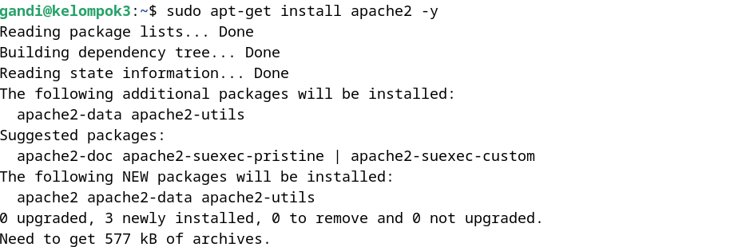<br>
    <em style="font-size:10px">Gambar 1. Install apache2 dan php-fpm</em>
</div><br>

#### 2. Konfigurasi apache2
Lakukan konfigurasi security apache2
- ```sudo nano /etc/apache2/conf-enabled/security.conf```
  
   Ubah bagian ```ServerTokens``` menjadi ```Prod```

<div align="center">
    
    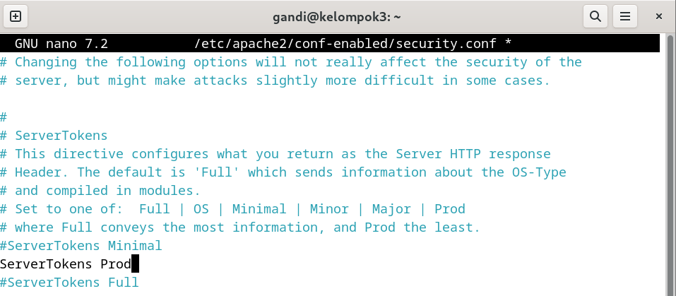<br>
    <em style="font-size:10px">Gambar 2.1 Konfigurasi security apache2</em>
</div><br>

Lakukan konfigurasi directory apache2 
- ```sudo nano /etc/apache2/mods-enabled/dir.conf```
  
    Ubah bagian ```DirectoryIndex``` menjadi ```index.html index.htm```

<div align="center">
    
    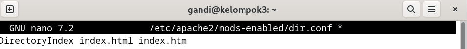<br>
    <em style="font-size:10px">Gambar 2.2 Konfigurasi directory apache2</em>
</div><br>

Tambahkan virtual host yang sudah disiapkan berdasarkan Canonical Name (CNAME) yang sudah dibuat (kelompok3.local)

- ```sudo nano /etc/apache2/apache2.conf```

Tambahkan ServerName www.kelompok3.local
  
<div align="center">
    
    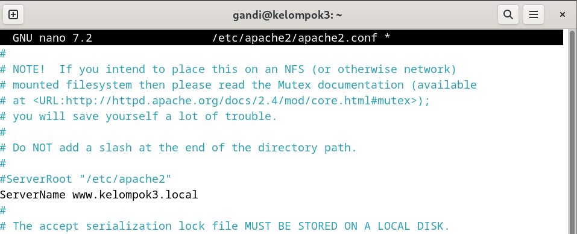<br>
    <em style="font-size:10px">Gambar 2.3 Menambahkan ServerName</em>
</div><br>

Ubah Kontak email admin menjadi email webmaster@kelompok3.local
- ```sudo nano /etc/apache2/sites-available/000-default.conf```
  
  Ubah bagian ```webmaster@localhost``` menjadi ```webmaster@kelompok3.local```

<div align="center">
    
    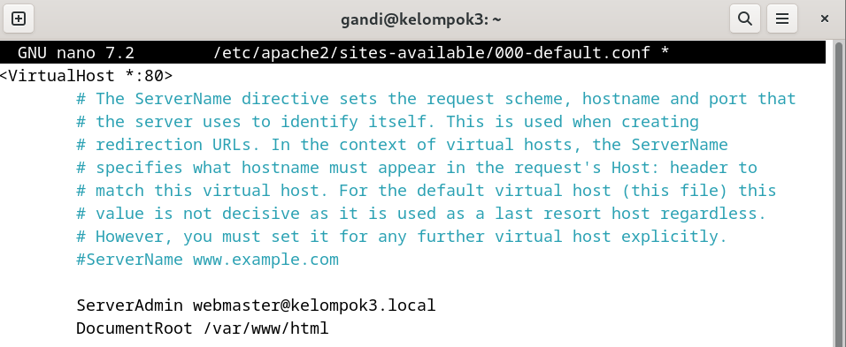<br>
    <em style="font-size:10px">Gambar 2.4 Mengubah email admin</em>
</div><br>

#### 3. Restart apache2 dan cek status apache2
```sudo systemctl restart apache2```
```sudo systemctl status apache2```

<div align="center">
    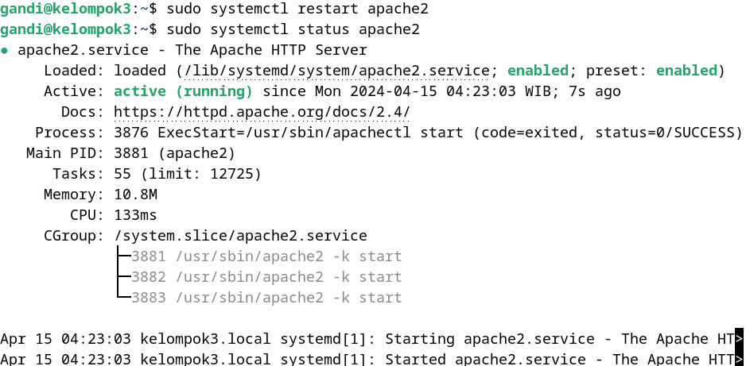<br>
    <em style="font-size:10px">Gambar 3. Restart dan cek status apache2</em>
</div><br>

#### 4. Lakukan Pengujian di browser
Buka browser dan ketikkan alamat www.kelompok3.local

<div align="center">
    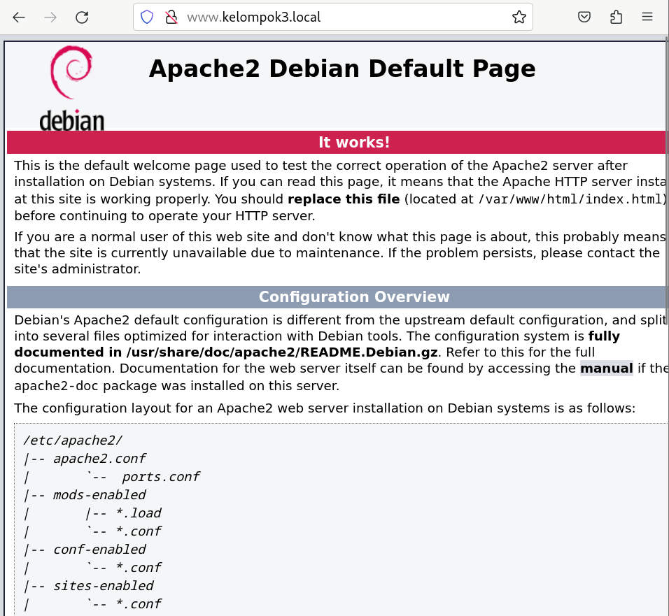<br>
    <em style="font-size:10px">Gambar 4. Pengujian di browser</em>
</div><br>

#### 5. Install PHP dan extensi mbstring serta lakukan pengujian
Fungsi mbstring digunakan untuk memanipulasi string atau text non  ASCII
```sudo apt -y install php8.2 php8.2-mbstring php-pear```
```php -v```

<div align="center">
    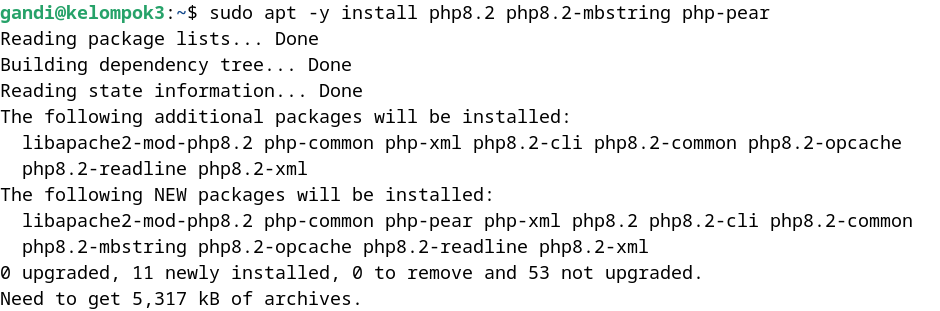
    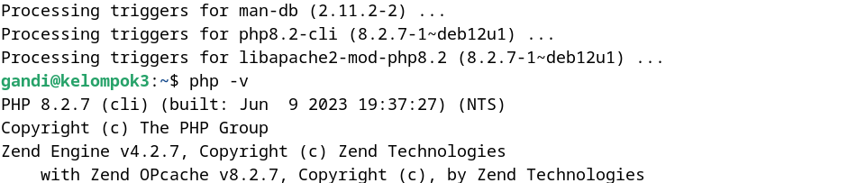<br>
    <em style="font-size:10px">Gambar 5.1 Install mbstring</em>
</div><br>

Buat file php_info.php di /var/www/html
```sudo nano /var/www/html/php_info.php```

Isi file php_info.php dengan kode berikut
```<?php phpinfo(); ?>```

Buka browser dan ketikkan alamat www.kelompok3.local/php_info.php

<div align="center">
    
    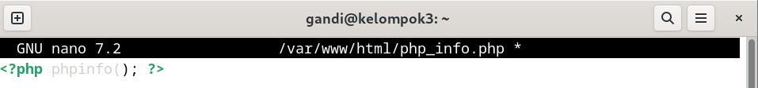
    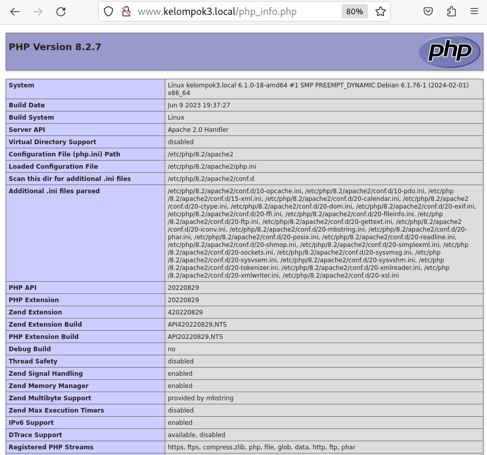<br>
    <em style="font-size:10px">Gambar 5.2 Pengujian mbstring</em>
</div><br>

#### 6. Install PHP-FPM
Php fpm adalah FastCGI Process Manager untuk PHP berfungsi sebagai server untuk PHP
```sudo apt -y install php-fpm```

<div align="center">
    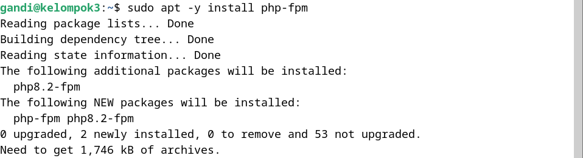<br>
    <em style="font-size:10px">Gambar 6. Install php-fpm</em>
</div><br>

#### 7. Konfigurasi PHP-FPM di apache2
- ```nano /etc/apache2/sites-available/default-ssl.conf```
    Berfungsi untuk mengarahkan apache2 ke php-fpm
    tambahkan di dalam tag ```<VirtualHost *:443></VirtualHost>```

    ```
    <FilesMatch \.php$>
        SetHandler "proxy:unix:/var/run/php/php8.2-fpm.sock|fcgi://localhost/"
    </FilesMatch>
    ```

<div align="center">
    
    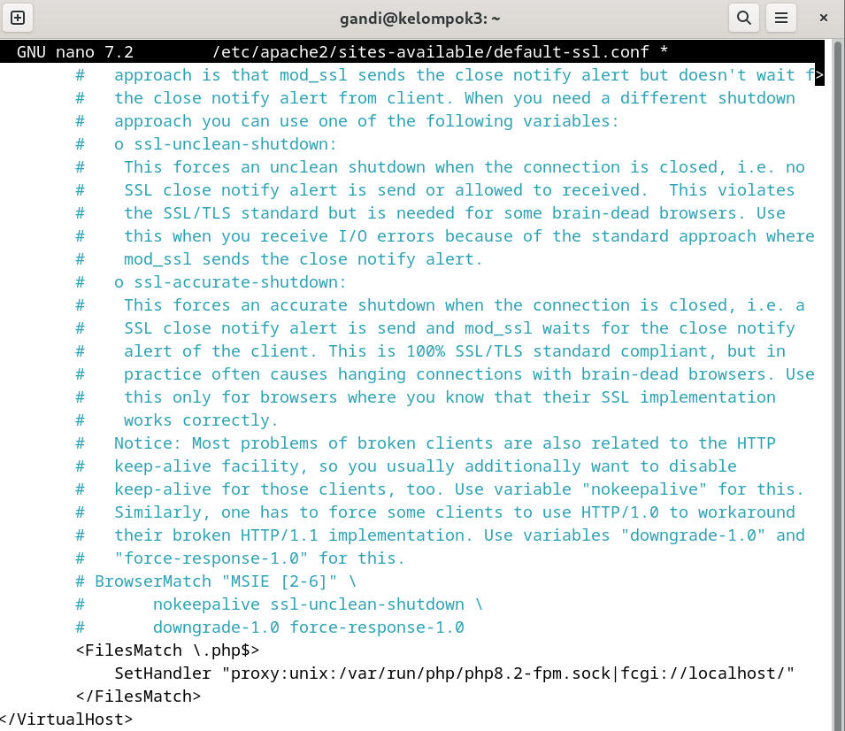<br>
    <em style="font-size:10px">Gambar 7.1 Konfigurasi php-fpm</em>
</div><br>

- ```a2enmod proxy_fcgi setenvif```
  Ini berfungsi untuk mengaktifkan modul proxy_fcgi dan setenvif
- ```a2enconf php8.2-fpm```
  Ini berfungsi untuk mengaktifkan konfigurasi php8.2-fpm
- ```systemctl restart php8.2-fpm apache2```
  Ini berfungsi untuk merestart php8.2-fpm dan apache2

<div align="center">
    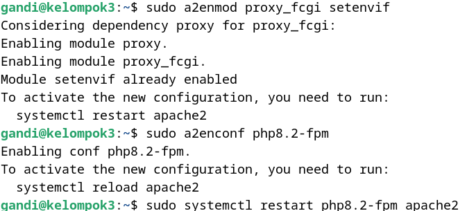<br>
    <em style="font-size:10px">Gambar 7.2 Konfigurasi php-fpm</em>
</div><br>